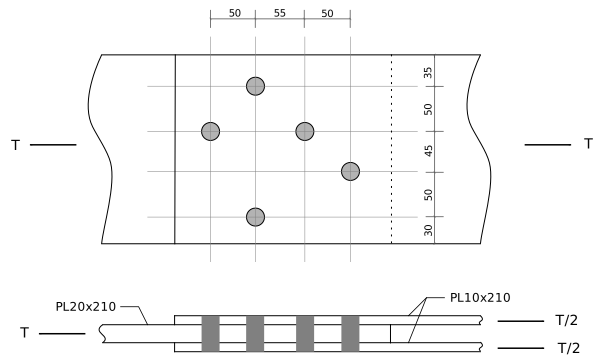
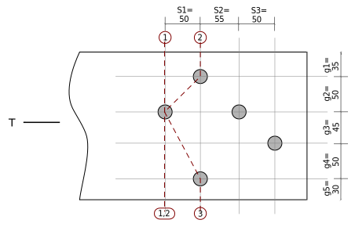

---
redirect_from:
  - "tension/t01/net-areas-01i"
interact_link: content/tension/T01/net-areas-01i.ipynb
kernel_name: python3
has_widgets: false
title: 'Net Areas (notebook)'
prev_page:
  url: /tension/T01/net-areas-01
  title: 'Net Areas (traditional)'
next_page:
  url: /tension/T01/net-areas-01u
  title: 'Net Areas (notebook with units)'
comment: "***PROGRAMMATICALLY GENERATED, DO NOT EDIT. SEE ORIGINAL FILES IN /content***"
---

# Example T01i: Net Areas of Plates with Staggered Holes

Please note that the following type of hole pattern rarely occurs in practice -- practical patterns are more regular and 'grid-like'.  This example illustrates:
* how failure patterns depend on the direction of the load relative to the hole group.
* the calculations necessary to determine a net cross-sectional area for each potential failure pattern.

The  figure shows an irregular bolt pattern in a lap tension splice.  To compute the
net areas of the plates, we must examine every possible failure path that has the
following attributes:

* it separates each plate into 2 complete parts.
* it is of minimum length for that path.
* there are no bolts or holes completely on the loaded side of the path; all of the bolt bearing areas are on the side opposite the load.

In the following example, we will assume M20 bolts in punched holes, and thus the hole
allowance is $20~\mathrm{mm}+2~\mathrm{mm}+2~\mathrm{mm} = 24~\mathrm{mm}$.



**Lap Plate Connection**

## 10mm Plates (outer plates)

The  shows the paths appropriate for investigating the strength of the outside (10mm) plates.
For this case, the loaded side of the connection is toward the right side, and so there are
no complete holes on that side of any path.

 plates")

**Failure Paths for Net Area Calculations, Outside (10mm) plates**

<div markdown="1" class="cell code_cell">
<div class="input_area" markdown="1">
```python
ha = 20 + 2 + 2          # hole allowance: bolt dia. + 2mm clearance + 2mm for punching
s1 = 50.
s2 = 55.
s3 = 50.
g1,g2,g3,g4,g5 = 35.,50.,45.,50.,30.
t1 = 10.                # thickness of one outside plate
t2 = 20.                # thickness of inside plate
wg = g1+g2+g3+g4+g5
wg
```
</div>

<div class="output_wrapper" markdown="1">
<div class="output_subarea" markdown="1">


{:.output_data_text}
```
210.0
```


</div>
</div>
</div>

### Path 1-1:

<div markdown="1" class="cell code_cell">
<div class="input_area" markdown="1">
```python
wn_11 = wg - ha
wn_11
```
</div>

<div class="output_wrapper" markdown="1">
<div class="output_subarea" markdown="1">


{:.output_data_text}
```
186.0
```


</div>
</div>
</div>

### Path 2-2:

$w_n = w - \sum d + \sum{s^2\over 4g}$

<div markdown="1" class="cell code_cell">
<div class="input_area" markdown="1">
```python
wn_22 = wg - 2*ha + s3**2/(4*g3)
wn_22
```
</div>

<div class="output_wrapper" markdown="1">
<div class="output_subarea" markdown="1">


{:.output_data_text}
```
175.88888888888889
```


</div>
</div>
</div>

### Path 3-3:

$w_n = w - \sum d + \sum{s^2\over 4g}$

<div markdown="1" class="cell code_cell">
<div class="input_area" markdown="1">
```python
wn_33 = wg - 3*ha + s3**2/(4*g3) + s2**2/(4*g2)
wn_33
```
</div>

<div class="output_wrapper" markdown="1">
<div class="output_subarea" markdown="1">


{:.output_data_text}
```
167.01388888888889
```


</div>
</div>
</div>

### Path 1-4:

Adding the fourth bolt to each of the above paths will reduce the net width by $24~\mathrm{mm}$
for the hole, then
increase it by $(s2+s3)^2/(4 g4)$ for the slope of the segment.  Therefore paths that include this hole will not govern if that term is less than 24.  However, given that these variable values might change,
its probably safest to compute them all.

<div markdown="1" class="cell code_cell">
<div class="input_area" markdown="1">
```python
delta = (s2+s3)**2/(4*g4) - ha    # the amount wn increases by including the hole on path 4
wn_14 = wn_11 + delta
wn_24 = wn_22 + delta
wn_34 = wn_33 + delta
delta, wn_14, wn_24, wn_34
```
</div>

<div class="output_wrapper" markdown="1">
<div class="output_subarea" markdown="1">


{:.output_data_text}
```
(31.125, 217.125, 207.01388888888889, 198.13888888888889)
```


</div>
</div>
</div>

### Summary

The path with the smallest $w_n$ governs,
so $A_n$ for the pair of 10 mm plates is:

<div markdown="1" class="cell code_cell">
<div class="input_area" markdown="1">
```python
wn = min(wn_11,wn_22,wn_33,wn_14,wn_24,wn_34)
wn
```
</div>

<div class="output_wrapper" markdown="1">
<div class="output_subarea" markdown="1">


{:.output_data_text}
```
167.01388888888889
```


</div>
</div>
</div>

<div markdown="1" class="cell code_cell">
<div class="input_area" markdown="1">
```python
An = wn * t1*2
An
```
</div>

<div class="output_wrapper" markdown="1">
<div class="output_subarea" markdown="1">


{:.output_data_text}
```
3340.277777777778
```


</div>
</div>
</div>

## 20mm Plate (Inner Plate)

The following figure  shows the possible failure paths for calculating the strength of the 20mm plate.
For this case, the loaded side is toward the left.



**Failure Paths for Net Area Calculations, Inside (20mm) plate**

### Path 1-1:

<div markdown="1" class="cell code_cell">
<div class="input_area" markdown="1">
```python
wn_11 = wg - ha
wn_11
```
</div>

<div class="output_wrapper" markdown="1">
<div class="output_subarea" markdown="1">


{:.output_data_text}
```
186.0
```


</div>
</div>
</div>

### Path 2-2:

<div markdown="1" class="cell code_cell">
<div class="input_area" markdown="1">
```python
wn_22 = wg - 2*ha + s1**2/(4*g2)
wn_22
```
</div>

<div class="output_wrapper" markdown="1">
<div class="output_subarea" markdown="1">


{:.output_data_text}
```
174.5
```


</div>
</div>
</div>

### Path 2-3:

<div markdown="1" class="cell code_cell">
<div class="input_area" markdown="1">
```python
wn_23 = wg - 3*ha + s1**2/(4*g2) + s1**2/(4*(g3+g4))
wn_23
```
</div>

<div class="output_wrapper" markdown="1">
<div class="output_subarea" markdown="1">


{:.output_data_text}
```
157.07894736842104
```


</div>
</div>
</div>

### Path 1-3:

By inspection this should not govern, as path 1-1 is longer than 2-2, therefore 1-3 will be longer than 2-3.

<div markdown="1" class="cell code_cell">
<div class="input_area" markdown="1">
```python
wn_13 = wg - 2*ha + s1**2/(4*(g3+g4))
wn_13
```
</div>

<div class="output_wrapper" markdown="1">
<div class="output_subarea" markdown="1">


{:.output_data_text}
```
168.57894736842104
```


</div>
</div>
</div>

### Summary

The shortest path (minimum $w_n$) governs, and so the net area, $A_n$, of the 20 mm plate is:

<div markdown="1" class="cell code_cell">
<div class="input_area" markdown="1">
```python
wn = min(wn_11,wn_22,wn_23,wn_13)
wn
```
</div>

<div class="output_wrapper" markdown="1">
<div class="output_subarea" markdown="1">


{:.output_data_text}
```
157.07894736842104
```


</div>
</div>
</div>

<div markdown="1" class="cell code_cell">
<div class="input_area" markdown="1">
```python
An = wn * t2
An
```
</div>

<div class="output_wrapper" markdown="1">
<div class="output_subarea" markdown="1">


{:.output_data_text}
```
3141.578947368421
```


</div>
</div>
</div>
