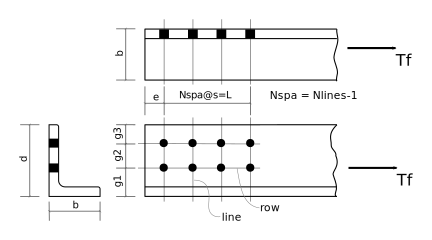

---
redirect_from:
  - "tension/t05/bolted-single-angle-01"
interact_link: content/tension/T05/bolted-single-angle-01.ipynb
kernel_name: python3
has_widgets: false
title: 'Single Angle, Bolted One Leg'
prev_page:
  url: /tension/T01/net-areas-01i
  title: 'Net Areas'
next_page:
  url: /tension/T10/lap-splice-01
  title: 'Lap Splice'
comment: "***PROGRAMMATICALLY GENERATED, DO NOT EDIT. SEE ORIGINAL FILES IN /content***"
---

### Tr for Single Angle Bolted Through One Leg

Calculate factored tension resistance, $T_r$, of a single angle bolted through one leg.



_Note:_ The figure shows 2 rows of 4 bolts through one leg.  The logic below works for
1 or 2 rows and almost any number of bolts per row.

<div markdown="1" class="cell code_cell">
<div class="input_area" markdown="1">
```python
from Designer import Part, DesignNotes, SST, show
```
</div>

</div>

<div markdown="1" class="cell code_cell">
<div class="input_area" markdown="1">
```python
Table6 = {'M16': (28,22),    # CSA S16-14 Table 6  - Minimum edge distances
          '3/4': (32,25),
          'M20': (34,26),
          '7/8': (38,28),
          'M22': (38,28),
          'M24': (42,30),
          '1':   (44,32),
         }

def get_Table6(size,col=1):
    assert col in [1,2], "Must select column 1 or 2 from Table 6."
    try:
        return Table6[size][col-1]
    except KeyError:
        pass
    raise KeyError('Cannot determine min edge distance for bolt size: "{}"'.format(size))
```
</div>

</div>

<div markdown="1" class="cell code_cell">
<div class="input_area" markdown="1">
```python
BOLT_DIA = {'M16': 16.,
           '3/4': 25.4*3/4,
           'M20': 20.,
           '7/8': 25.4*7/8,
           'M22': 22.,
           'M24': 24.,
           '1': 25.4,
           }

HOLE_DIA = {'M16': 18.,
           '3/4': 22.,
           'M20': 22.,
           '7/8': 24.,
           'M22': 24.,
           'M24': 26.,
           '1': 27.,
           }

BOLT_Fu = {'A325M': 830.,
          'A490M': 1040.,
          'A325': 825.,
          'A490': 1035.,
          }
```
</div>

</div>

<div markdown="1" class="cell code_cell">
<div class="input_area" markdown="1">
```python
#           Leg:   g, g1
UG_Angle = {203: (115,75),    # Usual Gauges for Angles, CISC Handbook 11th ed., p. 6-173
           178: (100,65),
           152: (90,60),
           127: (75,50),
           102: (65,),
           89: (50,),
           76: (45,),
           64: (35,),
           51: (29,),
           44: (25,),
            }

# select largest g2 from 45,50,55,60,65,70,75 > 2.7d and edge dist ok

def get_UG_Angle(leg,nlines=1,size='3/4'):
    leg = int(leg)
    if leg not in UG_Angle:
        raise ValueError('Cannot determine gauges for angle leg of size "{}"'.format(leg))
    
    gs = UG_Angle[leg]
    if nlines == 1:
        return gs[0],0
    if len(gs) == 1:
        raise ValueError('Leg size of "{}" cannot have 2 rows of bolts'.format(leg))
    g1 = gs[1]
    min_edge = get_Table6(size,col=2)
    d = BOLT_DIA[size]
    gmin = 2.7*d                         # CSA S16-14 23.3.1
    for g2 in [80,75,70,65,60,55,50,45]:
        if g2 >= gmin and (leg-g1-g2) >= min_edge:
            return g1,g2
    raise ValueError('Unable to determine workable gauges for angle, leg={}, size={}'.format(leg,size))
```
</div>

</div>

<div markdown="1" class="cell code_cell">
<div class="input_area" markdown="1">
```python
Bolt = Part( 'Bolts',
              type = 'A325',
              size = '3/4',
              hole_type = 'punched',  # 'punched' or 'drilled'
              Nrows = 2,              # a row is parallel to the load
              Nlines = 4,             # a line is perpendicular to the load
              pitch = 75.,            # spacing measure paprallel to load (along length of angle)
              end_distance = 35.,     # from end of angle to center of closest hole
              )

Bolt.set( Fu = BOLT_Fu[Bolt.type],
           d = BOLT_DIA[Bolt.size],
           ha = HOLE_DIA[Bolt.size] + (0. if Bolt.hole_type == 'drilled' else 2.),  # CSA S16-14 12.3.2
           )
Bolt.vars()
```
</div>

<div class="output_wrapper" markdown="1">
<div class="output_subarea" markdown="1">


{:.output_data_text}
```
{'Fu': 825.0,
 'Nlines': 4,
 'Nrows': 2,
 '_doc': 'Bolts',
 'd': 19.049999999999997,
 'end_distance': 35.0,
 'ha': 24.0,
 'hole_type': 'punched',
 'pitch': 75.0,
 'size': '3/4',
 'type': 'A325'}
```


</div>
</div>
</div>

<div markdown="1" class="cell code_cell">
<div class="input_area" markdown="1">
```python
Dsg = 'L178x102x13'
Ag,d,b,t = SST.section(Dsg,'A,D,B,T')
Angle = Part( 'Angle',
               Fy = 350.,
               Fu = 450.,
               dsg = Dsg,
               Ag = Ag,
               d = d,
               b = b,
               t = t,
               bolted_leg = 'long',   # 'short' or 'long'
               m = 1,    # number of faying surfaces
               threads_intercepted = True)
Angle.vars()
```
</div>

<div class="output_wrapper" markdown="1">
<div class="output_subarea" markdown="1">


{:.output_data_text}
```
{'Ag': 3390.0,
 'Fu': 450.0,
 'Fy': 350.0,
 '_doc': 'Angle',
 'b': 102.0,
 'bolted_leg': 'long',
 'd': 178.0,
 'dsg': 'L178x102x13',
 'm': 1,
 't': 12.7,
 'threads_intercepted': True}
```


</div>
</div>
</div>

<div markdown="1" class="cell code_cell">
<div class="input_area" markdown="1">
```python
des = DesignNotes('Tr',units='kN',trace=True,title='Angle bolted through single leg')

REQ = des.require   # useful abbreviations
CHK = des.check       
REC = des.record
```
</div>

</div>

### Sanity check of input data:

<div markdown="1" class="cell code_cell">
<div class="input_area" markdown="1">
```python
REQ(Bolt.size in BOLT_DIA,'bolt size is not one of available sizes',
    size=Bolt.size, SIZES=BOLT_DIA.keys())
REQ(Bolt.hole_type in ['punched','drilled'], "Value of 'hole_type' must be punched or drilled")
REQ(Angle.threads_intercepted in [False,True],"Value of 'threads_intercepted' must be True or False")
REQ(Angle.m in [1,2], 'Number of faying surfaces must be 1 or 2')
REQ(Angle.bolted_leg in ['short','long'],"Value of 'bolted_leg' must be short or long")
REQ(Bolt.Nrows in [1,2],"Nrows must be 1 or 2")
REQ(Bolt.Nlines >= 2 and Bolt.Nlines <= 10,"Nlines must be in range of 2 to 10")
```
</div>

</div>

<div markdown="1" class="cell code_cell">
<div class="input_area" markdown="1">
```python
# data derived from input data:  pitch, end_distance, gauges, etc.

Ag,d,b,t,bleg = Angle['Ag,d,b,t,bolted_leg']
if bleg == 'short':  # bolts go thru leg of size 'd'
    d,b = b,d
    
bolt_diameter,pitch = Bolt['d,pitch']
    
min_end_distance = min_edge_distance = get_Table6(Bolt.size,col=1)  # CSA S16-14 22.3.3
if Bolt.Nlines <= 2:
    min_end_distance = 1.5*bolt_diameter  # CSA S16-01 22.3.4

g1,g2 = get_UG_Angle(d,Bolt.Nrows,Bolt.size)
g3 = edge_distance = d-(g1+g2)
Angle.set( g1=g1, g2=g2, g3=g3 )
show('Ag,d,b,t,g1,g2,g3')
```
</div>

<div class="output_wrapper" markdown="1">
<div class="output_subarea" markdown="1">
{:.output_stream}
```
Ag = 3390
d  = 178
b  = 102
t  = 12.7
g1 = 65
g2 = 80
g3 = 33
```
</div>
</div>
</div>

### Check Bolting Details
Failure to meet requirements is not a fatal error. Results are reported in the work record.

<div markdown="1" class="cell code_cell">
<div class="input_area" markdown="1">
```python
# CSA S16-14  22.3.1, 22.3.2, 22.3.3, 22.3.4
max_edge_distance = min(12.*t,150.)
REQ(edge_distance > bolt_diameter/2.,
    'Angle leg of {0} mm does not support {1} lines of bolts.'.format(Bolt.d,Bolt.Nlines))
CHK(pitch >= 2.7*Bolt.d,
    'Pitch greater than minimum','pitch',min_pitch=2.7*bolt_diameter)
CHK(edge_distance >= min_edge_distance,
    'Edge distance greater than minimum','edge_distance,min_edge_distance')
CHK(edge_distance <= max_edge_distance,
    'Edge distance less than maximum','edge_distance,max_edge_distance')
end_distance = Bolt.end_distance
CHK(end_distance >= min_end_distance,
    'End distance greater than minimum','end_distance,min_end_distance')
```
</div>

<div class="output_wrapper" markdown="1">
<div class="output_subarea" markdown="1">
{:.output_stream}
```
    Pitch greater than minimum?  OK 
      (pitch=75.0, min_pitch=51.43)
    Edge distance greater than minimum?  OK 
      (edge_distance=33.0, min_edge_distance=32)
    Edge distance less than maximum?  OK 
      (edge_distance=33.0, max_edge_distance=150.0)
    End distance greater than minimum?  OK 
      (end_distance=35.0, min_end_distance=32)
```
</div>
</div>
<div class="output_wrapper" markdown="1">
<div class="output_subarea" markdown="1">


{:.output_data_text}
```
True
```


</div>
</div>
</div>

## Strength Calculations

<div markdown="1" class="cell code_cell">
<div class="input_area" markdown="1">
```python
# CSA S16-14  13.1
phi = 0.90
phiu = 0.75
phib = 0.80 
phibr = 0.80
```
</div>

</div>

### Gross section yield:

<div markdown="1" class="cell code_cell">
<div class="input_area" markdown="1">
```python
# CSA S16-14   13.2 (a) (i):
Ag,Fy = Angle['Ag,Fy']
REC(phi*Ag*Fy * 1E-3,'Gross area yield','Ag,Fy');
```
</div>

<div class="output_wrapper" markdown="1">
<div class="output_subarea" markdown="1">
{:.output_stream}
```
    Gross area yield: Tr = 1068 kN
       (Ag=3390, Fy=350.0)
```
</div>
</div>
</div>

### Net section fracture:

<div markdown="1" class="cell code_cell">
<div class="input_area" markdown="1">
```python
# CSA S16-14   13.2 (a) (iii):
Nrows,Nlines,ha = Bolt['Nrows,Nlines,ha']
Ag,t,Fu = Angle['Ag,t,Fu']
An = Ag - Nrows*ha*t                # CSA S16-14 12.3.1 a)
if Nlines >= 4:                     # CSA S16-14   12.3.3.2 (b)
    Ane = 0.80*An
else:
    Ane = 0.60*An
REC(phiu*Ane*Fu * 1E-3,'Net area fracture','An,Ane');
```
</div>

<div class="output_wrapper" markdown="1">
<div class="output_subarea" markdown="1">
{:.output_stream}
```
    Net area fracture: Tr = 750.7 kN
       (An=2780, Ane=2224)
```
</div>
</div>
</div>

### Block shear failure:


<div markdown="1" class="cell code_cell">
<div class="input_area" markdown="1">
```python
#  CSA S16-14    13.11
Nrows,Nlines,ha,e,s = Bolt['Nrows,Nlines,ha,end_distance,pitch']
d,t,g1,g2,Fy,Fu = Angle['d,t,g1,g2,Fy,Fu']
L = (Nlines-1.)*s

# Case 1 - one shear area, tension failure from furthest bolt to edge
An = (d - g1 - (Nrows-0.5)*ha)*t
Agv = (e+L)*t
Ut = 0.6
Fv = (Fy+Fu)/2.
if Fy > 460:     # CSA S16-14 13.11  (foot note)
    Fv = Fy
REC(phiu*(Ut*An*Fu + 0.6*Agv*Fv) * 1E-3,'Block shear (case 1)','An,Agv,Ut');
```
</div>

<div class="output_wrapper" markdown="1">
<div class="output_subarea" markdown="1">
{:.output_stream}
```
    Block shear (case 1): Tr = 792.4 kN
       (An=977.9, Agv=3302, Ut=0.6)
```
</div>
</div>
</div>

<div markdown="1" class="cell code_cell">
<div class="input_area" markdown="1">
```python
# Case 2 - for 2 or more rows of bolts    CSA S16-14 13.11
if Nrows > 1:
    An = (g2 - ha)*t
    Agv = 2.*(e+L)*t
    Ut = 0.6
    REC(phiu*(Ut*An*Fu + 0.6*Agv*Fv) * 1E-3,'Block shear (case 2)','An,Agv,Ut')
```
</div>

<div class="output_wrapper" markdown="1">
<div class="output_subarea" markdown="1">
{:.output_stream}
```
    Block shear (case 2): Tr = 1333 kN
       (An=711.2, Agv=6604, Ut=0.6)
```
</div>
</div>
</div>

<div markdown="1" class="cell code_cell">
<div class="input_area" markdown="1">
```python
# Case 3 - tearout     CSA S16-14 13.11 
An = 0.
Agv = 2.*(e+L)*t*Nrows
Ut = 0.
REC(phiu*(Ut*An*Fu + 0.6*Agv*Fv) * 1E-3,'Block shear (tearout)','An,Agv,Ut');
```
</div>

<div class="output_wrapper" markdown="1">
<div class="output_subarea" markdown="1">
{:.output_stream}
```
    Block shear (tearout): Tr = 2377 kN
       (An=0, Agv=13210, Ut=0)
```
</div>
</div>
</div>

### Fastener strength, bearing-type connection: bolts in shear

<div markdown="1" class="cell code_cell">
<div class="input_area" markdown="1">
```python
m,threads_in = Angle['m,threads_intercepted']
db,Fub,s,Nrows,Nlines = Bolt['d,Fu,pitch,Nrows,Nlines']

n = Nrows*Nlines
L = (Nlines-1.)*s   # length of connection

# CSA S16-14   13.12.1.2 (c)
multiplier = 1.0
if L >= 760.:
    multiplier *= 0.5/0.6
if threads_in:
    multiplier *= 0.70
Ab = (3.1415926*db*db/4.)
Vr = multiplier*0.6*phib*n*m*Ab*Fub * 1E-3
REC(Vr,'Bolt Shear','multiplier,m,n,Ab,Fub')
```
</div>

<div class="output_wrapper" markdown="1">
<div class="output_subarea" markdown="1">
{:.output_stream}
```
    Bolt Shear: Tr = 632.1 kN
       (multiplier=0.7, m=1, n=8, Ab=285.0, Fub=825.0)
```
</div>
</div>
<div class="output_wrapper" markdown="1">
<div class="output_subarea" markdown="1">


{:.output_data_text}
```
632.0668986443194
```


</div>
</div>
</div>

### Bolts in bearing:

<div markdown="1" class="cell code_cell">
<div class="input_area" markdown="1">
```python
# CSA S16-14    13.12.1.2 a):
Br = 3.*phibr*n*t*db*Fu * 1E-3
REC(Br,'Bolt Bearing',n=n,d=db,t=t);
```
</div>

<div class="output_wrapper" markdown="1">
<div class="output_subarea" markdown="1">
{:.output_stream}
```
    Bolt Bearing: Tr = 2090 kN
       (n=8, d=19.05, t=12.7)
```
</div>
</div>
</div>

#### Combined tearout and bearing:

<div markdown="1" class="cell code_cell">
<div class="input_area" markdown="1">
```python
# combine tearout of bolts closest to end with bearing of remainder
e,db,Nlines,Nrows = Bolt['end_distance,d,Nlines,Nrows']
t = Angle['t']
Agv = 2.*e*t*Nrows
n = Nrows*(Nlines-1)
Tr = phiu*(0.6*Agv*Fv) * 1E-3      # S16-14 13.11
Br = 3.*phibr*n*t*db*Fu * 1E-3     # S16-14 13.12.1.2 b)
REC(Tr+Br,'Bolt bearing + end tearout',n=n,d=db,t=t,Agv=Agv,Tr=Tr,Br=Br);
```
</div>

<div class="output_wrapper" markdown="1">
<div class="output_subarea" markdown="1">
{:.output_stream}
```
    Bolt bearing + end tearout: Tr = 1888 kN
       (n=6, d=19.05, t=12.7, Agv=1778, Br=1568)
```
</div>
</div>
</div>

<div markdown="1" class="cell code_cell">
<div class="input_area" markdown="1">
```python
# combine block shear of bolts closes to end with bearing of remainder (CSA S16-14: 13.12.1.2 b))
Nrows,Nlines,ha,e,s = Bolt['Nrows,Nlines,ha,end_distance,pitch']
if Nrows > 1:
    d,t,g1,g2,Fy,Fu = Angle['d,t,g1,g2,Fy,Fu']
    Fv = (Fy+Fu)/2.
    if Fy > 460:     # CSA S16-14 13.11  (foot note)
        Fv = Fy
    An = (g2 - ha)*t
    Agv = 2.*e*t
    Ut = 0.6
    Tr = phiu*(Ut*An*Fu + 0.6*Agv*Fv) * 1E-3      # S16-14 13.11
    n = Nrows*(Nlines-1)
    Br = 3.*phibr*n*t*db*Fu * 1E-3     # S16-14 13.12.1.2 b)
    REC(Tr+Br,'Bolt bearing + end block shear (case 2)','g2,ha,t,An,Ut,Agv,db,Tr,Br')    
```
</div>

<div class="output_wrapper" markdown="1">
<div class="output_subarea" markdown="1">
{:.output_stream}
```
    Bolt bearing + end block shear (case 2): Tr = 1872 kN
       (g2=80, ha=24.0, t=12.7, An=711.2, Ut=0.6, Agv=889.0, db=19.05, Br=1568)
```
</div>
</div>
</div>

## Summary:

<div markdown="1" class="cell code_cell">
<div class="input_area" markdown="1">
```python
des.summary()          
```
</div>

<div class="output_wrapper" markdown="1">
<div class="output_subarea" markdown="1">
{:.output_stream}
```

Summary of DesignNotes for Tr: Angle bolted through single leg
==============================================================

Checks:
-------
    Pitch greater than minimum?           OK 
      (pitch=75.0, min_pitch=51.43)
    Edge distance greater than minimum?   OK 
      (edge_distance=33.0, min_edge_distance=32)
    Edge distance less than maximum?      OK 
      (edge_distance=33.0, max_edge_distance=150.0)
    End distance greater than minimum?    OK 
      (end_distance=35.0, min_end_distance=32)

Values of Tr:
-------------
    Gross area yield:                        Tr = 1070 kN
    Net area fracture:                       Tr = 751 kN
    Block shear (case 1):                    Tr = 792 kN
    Block shear (case 2):                    Tr = 1330 kN
    Block shear (tearout):                   Tr = 2380 kN
    Bolt Shear:                              Tr = 632 kN  <-- governs
    Bolt Bearing:                            Tr = 2090 kN
    Bolt bearing + end tearout:              Tr = 1890 kN
    Bolt bearing + end block shear (case 2): Tr = 1870 kN

    Governing Value:
    ----------------
       Tr = 632 kN
```
</div>
</div>
</div>
