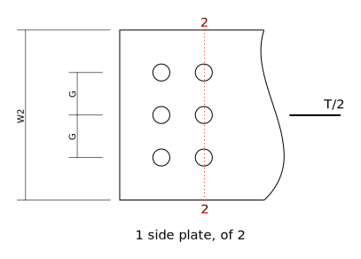

---
redirect_from:
  - "tension/t10/lap-splice-01"
interact_link: content/tension/T10/lap-splice-01.ipynb
kernel_name: python3
has_widgets: false
title: 'Lap Splice'
prev_page:
  url: /tension/example_problems_01
  title: 'Example Problems'
next_page:
  url: 
  title: ''
comment: "***PROGRAMMATICALLY GENERATED, DO NOT EDIT. SEE ORIGINAL FILES IN /content***"
---

# Tension Member: Lap Splice
Compute the factored tension resistance, $T_r$, of the following plate tension member, lap splice and fasteners.
Ignore the connection details at the far ends of the member (not shown).  Bolts are 3/4" A325 in a
bearing-type connection (assume threads intercepted).  The plates are of CSA G40.21 350W steel.


<div markdown="1" class="cell code_cell">
<div class="input_area" markdown="1">
```python
import sys
sys.path[1:1] = ['../../ca-steel-design/lib']
from Designer import show,Recorder
```
</div>

</div>

<div markdown="1" class="cell code_cell">
<div class="input_area" markdown="1">
```python
# Material properties:
Fy = 350.   # CSA G40.21 350W
Fu = 450.
Fub = 825.  # bolt, ASTM A325
# Main plate dimensions:
W1 = 300.
T1 = 25.
C = 10.   # clearance between ends
# Lap plate dimensions:
W2 = 220.
T2 = 14.
L2 = 350.
# bolting dimensions
D = 25.4*(3/4)   # bolt dia
threads_intercepted = True
HA = 22. + 2.  # hole allowance - 3/4" bolts in 22mm punched holes
G = 75.     # gauge (transverse spacing)
S = 75.     # longitudinal spacing
NT = 3      # number of bolts across
NL = 2      # number of lines of bolts each side
S2 = 140.
show('Fy,Fu,Fub,W1,T1,C,W2,T2,L2,D,HA,G,S,S2,NT,NL')
```
</div>

<div class="output_wrapper" markdown="1">
<div class="output_subarea" markdown="1">
{:.output_stream}
```
Fy  = 350
Fu  = 450
Fub = 825
W1  = 300
T1  = 25
C   = 10
W2  = 220
T2  = 14
L2  = 350
D   = 19.05
HA  = 24
G   = 75
S   = 75
S2  = 140
NT  = 3
NL  = 2
```
</div>
</div>
</div>

## Check Bolting Details
Edge distance, end distance and spacing

<div markdown="1" class="cell code_cell">
<div class="input_area" markdown="1">
```python
assert NT >= 2    # number of longitudinal lines (# of bolts per transverse line)
assert NL >= 2    # number of transverse lines (# of bolts per longitudinal line)
```
</div>

</div>

<div markdown="1" class="cell code_cell">
<div class="input_area" markdown="1">
```python
min_edge = 32   # S16 22.3.2, min edge distance, 3/4" bolt, sheared edge, Table 6
max_edge = min(12*T2,150) # S16 22.3.3
min_end = min_edge if NL > 2 else 1.5*D  # S16 22.3.4
min_pitch = 2.7*D    # S16 22.3.1
show('min_pitch,min_edge,min_end,max_edge')
```
</div>

<div class="output_wrapper" markdown="1">
<div class="output_subarea" markdown="1">
{:.output_stream}
```
min_pitch = 51.43
min_edge  = 32
min_end   = 28.57
max_edge  = 150
```
</div>
</div>
</div>

### Center plate:

<div markdown="1" class="cell code_cell">
<div class="input_area" markdown="1">
```python
edge = (W1 - (NT-1)*G)/2.
end = (S2 - C)/2.
show('edge,end')
assert edge >= min_edge
assert edge <= max_edge
assert end >= min_end
##assert S >= min_pitch
##assert G >= min_pitch
assert S2 >= S
assert S**2 + G**2 >= min_pitch**2    # to be more precise ...
```
</div>

<div class="output_wrapper" markdown="1">
<div class="output_subarea" markdown="1">
{:.output_stream}
```
edge = 75
end  = 65
```
</div>
</div>
</div>

### Lap plates:

<div markdown="1" class="cell code_cell">
<div class="input_area" markdown="1">
```python
edge = (W2 - (NT-1)*G)/2.
end = (L2 - ((NL-1)*G*2 + S2))/2.
show('edge,end')
assert edge >= min_edge
assert edge <= max_edge
assert end >= min_end
```
</div>

<div class="output_wrapper" markdown="1">
<div class="output_subarea" markdown="1">
{:.output_stream}
```
edge = 35
end  = 30
```
</div>
</div>
</div>

## Factored Resistance

<div markdown="1" class="cell code_cell">
<div class="input_area" markdown="1">
```python
record = Recorder()
```
</div>

</div>

### Main plate


#### Yield on Gross Area

If the gross (unreduced) cross-section reaches the yield stress, there will be considerable
axial elongation as yield strains are reached over the length of the member.  This is considered a failure state.

<div markdown="1" class="cell code_cell">
<div class="input_area" markdown="1">
```python
Ag = W1*T1    # gross x-sectional area
phi = 0.9
Tr = phi*Ag*Fy * 1E-3  # S16 13.2 a) i)
show('Ag,Tr')
record('Tr',Tr,'13.2 a) i) - gross area yield, centre plate')
```
</div>

<div class="output_wrapper" markdown="1">
<div class="output_subarea" markdown="1">
{:.output_stream}
```
Ag = 7500
Tr = 2362
```
</div>
</div>
</div>

#### Fracture on Effective Net Area
When the average stress across the net (reduced) area reaches the fracture stress, 
fracture will occur on that area.  This is, of
course, a failure mode.  Normally, an account is made of how non-uniform load transfers can affect the stress
distribution across the cross-section; if the stress distribution is markedly non-uniform, fracture may occur *before* the average stress reaches the ultimate.   This account 
is done by computing and using an effective net area, $A_{ne}$.  

Because the 
bolts in this connection transfer loads approximately uniformly across the entire cross-section, we can consider the effective net area to be equal to the net area in possible failure path 1 in the above figure.   (S16 12.3.3.1)

<div markdown="1" class="cell code_cell">
<div class="input_area" markdown="1">
```python
wn = W1 - NT*HA    # net width: subtract total width of material removed by holes, failure path 1
Ane = An = wn*T1
phiu = 0.75
Tr = phiu*Ane*Fu * 1E-3    # S16 13.2 a) iii)
show('wn,An,Ane,Tr')
record('Tr',Tr,'13.2 a) iii) - Net section fracture, centre plate')
```
</div>

<div class="output_wrapper" markdown="1">
<div class="output_subarea" markdown="1">
{:.output_stream}
```
wn  = 228
An  = 5700
Ane = 5700
Tr  = 1924
```
</div>
</div>
</div>

#### Block Shear
Other potential failure modes involve tension and shear ruptures in combination around
the bolt holes.  The following figure shows 4 different potential failure patterns that must be
investigated. 

Patterns 1 and 2 are sort of "opposites" - in Pattern 1 in the tension rupture extends across the
end of the bolts, while in Pattern 2 the tension rupture extends from one line of bolts to
the outside edges of the plates.  Pattern 2 probably is only important when there are 2 longitudinal
lines of bolts (there are three shown on the drawing, though our calculations will allow
for any number, 2 or more).  If there are more than 3 longitudnal lines (I.e., more than 3 bolts across),
other patterns similar to Pattern 2 could be drawn but thay will not have lower strengths.

Note that Pattern 4 is often called 'tear-out' or 'pull-out'.


<div markdown="1" class="cell code_cell">
<div class="input_area" markdown="1">
```python
## Pattern 1
e = S2/2. - C/2.     # end distance to centre of 1st bolt hole
Agv = (e + (NL-1)*S)*T1*2.  # shear area
An = (NT-1)*G * T1          # tension area
Ut = 1.0
phiu = 0.75
Tr = phiu*((Ut*An*Fu) + (0.6*Agv*(Fy+Fu)/2.)) * 1E-3     # S16 13.11
show('Ut,An,Agv,Tr')
record('Tr',Tr,'13.2 a) ii) - 13.11 - Block Shear Pattern 1 - centre plate')
```
</div>

<div class="output_wrapper" markdown="1">
<div class="output_subarea" markdown="1">
{:.output_stream}
```
Ut  = 1
An  = 3750
Agv = 7000
Tr  = 2526
```
</div>
</div>
</div>

<div markdown="1" class="cell code_cell">
<div class="input_area" markdown="1">
```python
## Pattern 2
Agv = 2.*(e + (NL-1)*S)*T1  # shear area
g1 = (W1 - (NT-1)*G)/2.  # edge distance to centre of hole
An = (g1 + g1 - 2.*HA/2.)*T1    # to outside from edge of outside pair of holes
if NT >= 3:
    An = An + (NT-2.)*(G - 2.*HA/2.)*T1    # additional between holes
Ut = 0.6                 # no good guidelines in commentary - this should be conservative
Tr = phiu*((Ut*An*Fu) + (0.6*Agv*(Fy+Fu)/2.)) * 1E-3     # S16 13.11
show('Ut,An,Agv,Tr')
record('Tr',Tr,'13.2 a) ii) - 13.11 - Block Shear Pattern 2 - centre plate')    
```
</div>

<div class="output_wrapper" markdown="1">
<div class="output_subarea" markdown="1">
{:.output_stream}
```
Ut  = 0.6
An  = 4425
Agv = 7000
Tr  = 2156
```
</div>
</div>
</div>

<div markdown="1" class="cell code_cell">
<div class="input_area" markdown="1">
```python
## Pattern 3
Agv = (e + (NL-1)*S)*T1  # shear area
g1 = (W1 - (NT-1)*G)/2.  # edge distance to centre of hole
An = ((W1-g1) - (NT-0.5)*HA)*T1
Ut = 0.6                 # no good guidelines in commentary - this should be conservative
Tr = phiu*((Ut*An*Fu) + (0.6*Agv*(Fy+Fu)/2.)) * 1E-3     # S16 13.11
show('Ut,An,Agv,Tr')
record('Tr',Tr,'13.2 a) ii) - 13.11 - Block Shear Pattern 3 - centre plate')
```
</div>

<div class="output_wrapper" markdown="1">
<div class="output_subarea" markdown="1">
{:.output_stream}
```
Ut  = 0.6
An  = 4125
Agv = 3500
Tr  = 1465
```
</div>
</div>
</div>

<div markdown="1" class="cell code_cell">
<div class="input_area" markdown="1">
```python
## Pattern 4 - tear-out
Agv = (e + (NL-1)*S)*T1 * (NT*2.) # shear area
An = 0.
Ut = 0.               # N.A.
Tr = phiu*((Ut*An*Fu) + (0.6*Agv*(Fy+Fu)/2.)) * 1E-3     # S16 13.11
show('Ut,An,Agv,Tr')
record('Tr',Tr,'13.2 a) ii) - 13.11 - Block Shear Pattern 4 - centre plate')
```
</div>

<div class="output_wrapper" markdown="1">
<div class="output_subarea" markdown="1">
{:.output_stream}
```
Ut  = 0
An  = 0
Agv = 21000
Tr  = 3780
```
</div>
</div>
</div>

### Lap Plates


The side plates have similar failure modes and so will be computed here without much additional comment.  In all cases we will use the dimensions of a single plate, then will multiply the resistance by 2 to
account for the two plates.

#### Yield on Gross Area

<div markdown="1" class="cell code_cell">
<div class="input_area" markdown="1">
```python
Ag = W2*T2    # gross x-sectional area
phi = 0.9
Tr = 2. * phi*Ag*Fy * 1E-3  # S16 13.2 a) i)
show('Ag,Tr')
record('Tr',Tr,'13.2 a) i) - gross area yield, two side plates')
```
</div>

<div class="output_wrapper" markdown="1">
<div class="output_subarea" markdown="1">
{:.output_stream}
```
Ag = 3080
Tr = 1940
```
</div>
</div>
</div>

#### Fracture on Effective Net Area

<div markdown="1" class="cell code_cell">
<div class="input_area" markdown="1">
```python
wn = W2 - NT*HA    # subtract total width of material removed by holes, failure path 2
Ane = An = wn*T2
phiu = 0.75
Tr = 2. * phiu*Ane*Fu * 1E-3    # S16 13.2 a) iii)
show('wn,An,Ane,Tr')
record('Tr',Tr,'13.2 a) iii) - Net section fracture, two side plates')
```
</div>

<div class="output_wrapper" markdown="1">
<div class="output_subarea" markdown="1">
{:.output_stream}
```
wn  = 148
An  = 2072
Ane = 2072
Tr  = 1399
```
</div>
</div>
</div>

#### Block Shear


<div markdown="1" class="cell code_cell">
<div class="input_area" markdown="1">
```python
## Pattern 1
e = (L2 - S2 - (NL-1)*S*2.)/2.   # end distance to centre of 1st bolt hole
Agv = (e + (NL-1)*S)*T2*2.  # shear area
An = (NT-1)*G * T2          # tension area
Ut = 1.0
phiu = 0.75
Tr = 2. * phiu*((Ut*An*Fu) + (0.6*Agv*(Fy+Fu)/2.)) * 1E-3     # S16 13.11
show('Ut,An,Agv,Tr')
record('Tr',Tr,'13.2 a) ii) - 13.11 - Block Shear Pattern 1 - two side plates')
```
</div>

<div class="output_wrapper" markdown="1">
<div class="output_subarea" markdown="1">
{:.output_stream}
```
Ut  = 1
An  = 2100
Agv = 2940
Tr  = 2476
```
</div>
</div>
</div>

<div markdown="1" class="cell code_cell">
<div class="input_area" markdown="1">
```python
## Pattern 2
Agv = 2.*(e + (NL-1)*S)*T2  # shear area
g1 = (W2 - (NT-1)*G)/2.  # edge distance to centre of hole
An = (g1 + g1 - 2.*HA/2.)*T2    # to outside from edge of outside pair of holes
if NT >= 3:
    An = An + (NT-2.)*(G - 2.*HA/2.)*T2    # additional between holes
Ut = 0.6                 # no good guidelines in commentary - this should be conservative
Tr = 2. * phiu*((Ut*An*Fu) + (0.6*Agv*(Fy+Fu)/2.)) * 1E-3     # S16 13.11
show('Ut,An,Agv,Tr')
record('Tr',Tr,'13.2 a) ii) - 13.11 - Block Shear Pattern 2 - two side plates')    
```
</div>

<div class="output_wrapper" markdown="1">
<div class="output_subarea" markdown="1">
{:.output_stream}
```
Ut  = 0.6
An  = 1358
Agv = 2940
Tr  = 1608
```
</div>
</div>
</div>

<div markdown="1" class="cell code_cell">
<div class="input_area" markdown="1">
```python
## Pattern 3
Agv = (e + (NL-1)*S)*T2  # shear area
g2 = (W2 - (NT-1)*G)/2.  # edge distance to centre of hole
An = ((W2-g2) - (NT-0.5)*HA)*T2
Ut = 0.6                 # no good guidelines in commentary - this should be conservative
Tr = 2. * phiu*((Ut*An*Fu) + (0.6*Agv*(Fy+Fu)/2.)) * 1E-3     # S16 13.11
show('Ut,An,Agv,Tr')
record('Tr',Tr,'13.2 a) ii) - 13.11 - Block Shear Pattern 3 - two side plates')
```
</div>

<div class="output_wrapper" markdown="1">
<div class="output_subarea" markdown="1">
{:.output_stream}
```
Ut  = 0.6
An  = 1750
Agv = 1470
Tr  = 1238
```
</div>
</div>
</div>

<div markdown="1" class="cell code_cell">
<div class="input_area" markdown="1">
```python
## Pattern 4 - tear-out
Agv = (e + (NL-1)*S)*T2 * (NT*2.) # shear area
An = 0.
Ut = 0.               # N.A.
Tr = 2. * phiu*((Ut*An*Fu) + (0.6*Agv*(Fy+Fu)/2.)) * 1E-3     # S16 13.11
show('Ut,An,Agv,Tr')
record('Tr',Tr,'13.2 a) ii) - 13.11 - Block Shear Pattern 4 - two side plates')
```
</div>

<div class="output_wrapper" markdown="1">
<div class="output_subarea" markdown="1">
{:.output_stream}
```
Ut  = 0
An  = 0
Agv = 8820
Tr  = 3175
```
</div>
</div>
</div>

### Fasteners (Bolts)

#### Shear

Here we compute the shear strength of one of the bolt groups.

<div markdown="1" class="cell code_cell">
<div class="input_area" markdown="1">
```python
n = NT*NL      # number of bolts
m = 2.         # number of faying surfaces
Ab = 3.14159*D*D/4.
phib = 0.80
Vr = 0.60*phib*n*m*Ab*Fub * 1E-3      # S16 13.12.1.2 c)
if (NL-1)*S >= 760.:
    Vr = (0.5/0.6)*Vr
if threads_intercepted:
    Vr = 0.7*Vr
show('n,m,Ab,Vr')
record('Tr',Vr,'13.12.1.2 c) - shear resistance of bolts')
```
</div>

<div class="output_wrapper" markdown="1">
<div class="output_subarea" markdown="1">
{:.output_stream}
```
n  = 6
m  = 2
Ab = 285
Vr = 948.1
```
</div>
</div>
</div>

#### Bearing

<div markdown="1" class="cell code_cell">
<div class="input_area" markdown="1">
```python
n = NT*NL
t = min(T1,2.*T2)
phibr = 0.80
Br = 3.*phibr*n*t*D*Fu * 1E-3
show('n,t,Br')
record('Tr',Br,'13.12.1.2 a) - bearing resistance at bolt holes')
```
</div>

<div class="output_wrapper" markdown="1">
<div class="output_subarea" markdown="1">
{:.output_stream}
```
n  = 6
t  = 25
Br = 3086
```
</div>
</div>
</div>

## Summary

<div markdown="1" class="cell code_cell">
<div class="input_area" markdown="1">
```python
record.summary()
```
</div>

<div class="output_wrapper" markdown="1">
<div class="output_subarea" markdown="1">
{:.output_stream}
```
            Tr = 2362     - 13.2 a) i) - gross area yield, centre plate                  
            Tr = 1924     - 13.2 a) iii) - Net section fracture, centre plate            
            Tr = 2526     - 13.2 a) ii) - 13.11 - Block Shear Pattern 1 - centre plate   
            Tr = 2156     - 13.2 a) ii) - 13.11 - Block Shear Pattern 2 - centre plate   
            Tr = 1465     - 13.2 a) ii) - 13.11 - Block Shear Pattern 3 - centre plate   
            Tr = 3780     - 13.2 a) ii) - 13.11 - Block Shear Pattern 4 - centre plate   
            Tr = 1940     - 13.2 a) i) - gross area yield, two side plates               
            Tr = 1399     - 13.2 a) iii) - Net section fracture, two side plates         
            Tr = 2476     - 13.2 a) ii) - 13.11 - Block Shear Pattern 1 - two side plates
            Tr = 1608     - 13.2 a) ii) - 13.11 - Block Shear Pattern 2 - two side plates
            Tr = 1238     - 13.2 a) ii) - 13.11 - Block Shear Pattern 3 - two side plates
            Tr = 3175     - 13.2 a) ii) - 13.11 - Block Shear Pattern 4 - two side plates
governs --> Tr = 948.1    - 13.12.1.2 c) - shear resistance of bolts                     
            Tr = 3086     - 13.12.1.2 a) - bearing resistance at bolt holes              
```
</div>
</div>
</div>

## Things not done
* L/r ratio
* Connections at ends
