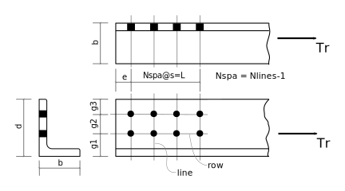
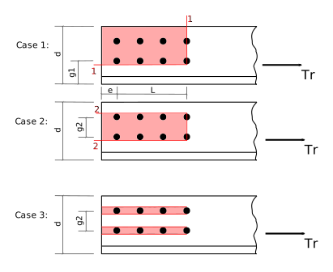

---
redirect_from:
  - "tension/t15/bolted-single-angle-01u"
interact_link: content/tension/T15/bolted-single-angle-01u.ipynb
kernel_name: python3
has_widgets: false
title: 'T15. Angle, Bolted One Leg'
prev_page:
  url: /tension/T10/lap-splice-01
  title: 'T10. Lap Splice'
next_page:
  url: /tension/T20/W-brace-01
  title: 'T20. W Brace'
comment: "***PROGRAMMATICALLY GENERATED, DO NOT EDIT. SEE ORIGINAL FILES IN /content***"
---

# Example T15: Tension Member -  Angle Bolted Through One Leg

Calculate factored tension resistance, $T_r$, of a single angle bolted through one leg.
Assume 3/4" ASTM A325 bolts in 22mm punched holes, and CSA G40.21 350W steel.



_Note:_ The figure shows 2 rows of 4 bolts through one leg.  The logic below works for
1 or 2 rows and almost any number of bolts per row.  It also works for 1 or 2 angles, back-to-back.

### Import and Setup Library Modules

<div markdown="1" class="cell code_cell">
<div class="input_area" markdown="1">
```python
from Designer import Part, DesignNotes, SST, show
```
</div>

</div>

<div markdown="1" class="cell code_cell">
<div class="input_area" markdown="1">
```python
import pint                  # setup to use the module for computing with units
ureg = pint.UnitRegistry()
mm = ureg['mm']
inch = ureg['inch']
kN = ureg['kN']
MPa = ureg['MPa']
ureg.default_format = '~P'
```
</div>

</div>

<div markdown="1" class="cell code_cell">
<div class="input_area" markdown="1">
```python
notes = DesignNotes('Tr',units=kN,trace=True,title='Angle bolted through single leg')

REQ = notes.require   # useful abbreviations
CHK = notes.check       
REC = notes.record
```
</div>

</div>

### Define the Design Parameters

<div markdown="1" class="cell code_cell">
<div class="input_area" markdown="1">
```python
Bolts = Part( 'Bolts',
               grade = 'ASTM A325',
               size = '3/4"',
               d = (3/4*inch).to(mm),
               Fu = 825*MPa,
              )
Bolts.set( 
               Ab = 3.14159*Bolts.d**2/4,
           )
```
</div>

</div>

<div markdown="1" class="cell code_cell">
<div class="input_area" markdown="1">
```python
Dsg = 'L178x102x13'
Ag,d,b,t = SST.section(Dsg,'A,D,B,T')
Angle = Part( 'Angle',
               grade = "CSA G40.21 350W",
               Fy = 350*MPa,
               Fu = 450*MPa,
               dsg = Dsg,             # copy dimensions from SST
               Ag = Ag*mm*mm,
               d = d*mm,              # normally the long leg
               b = b*mm,              # normally the short leg
               t = t*mm,              # always the thickness :-)
               bolted_leg = 'long',    # 'long' (usually) or 'short'
               n = 1,                  # number of angles (may be 1 or 2)
               threads_intercepted = True,
               hole_type = 'punched',  # 'punched' or 'drilled'
               Nrows = 2,              # a row is parallel to the load
               Nlines = 4,             # a line is perpendicular to the load
               pitch = 75*mm,          # spacing measure paprallel to load (along length of angle)
               end_distance = 35*mm,   # from end of angle to center of closest hole
             # for one row of bolts:
               g = 100*mm,
             # for two rows of bolts:
               g1 = 65*mm,             # gauge to first row of bolts, CISC HB-11 p. 6-173
               g2 = 80*mm,             # gauge to second row of bolts, or 0 if only 1 row
             )
Angle.set(     # ha = hole allowance by CSA S16-14 12.3.2:
               ha = 22*mm + (0*mm if Angle.hole_type == 'drilled' else 2*mm),
            )

if Angle.bolted_leg == 'short':
    Angle.set( d=Angle.b, b=Angle.d )  # d will always be dimension of bolted leg

if Angle.Nrows == 1:                   # below we will use only g1, g2, g3
    Angle.set( g1=Angle.g, g2=0*mm )
elif Angle.Nrows == 2:
    Angle.set( g=0*mm )
```
</div>

</div>

### Sanity check of input data:

If any of these requirements are not met, execution will stop with an error message.

<div markdown="1" class="cell code_cell">
<div class="input_area" markdown="1">
```python
REQ(Angle.hole_type in ['punched','drilled'], 
    "Value of 'Angle.hole_type' must be punched or drilled")
REQ(Angle.threads_intercepted in [False,True],
    "Value of 'Angle.threads_intercepted' must be True or False")
REQ(Angle.n in [1,2], 
    'Number of angles, Angle.n, must be 1 or 2')
REQ(Angle.bolted_leg in ['short','long'],
    "Value of 'Angle.bolted_leg' must be short or long")
REQ(Angle.Nrows in [1,2],
    "Angle.Nrows must be 1 or 2")
REQ(Angle.Nlines >= 2 and Angle.Nlines <= 10,
    "Angle.Nlines must be in range of 2 to 10")
```
</div>

</div>

### Check Bolting Details
Failure to meet criteria is not a fatal error. Results are reported in the work record.

<div markdown="1" class="cell code_cell">
<div class="input_area" markdown="1">
```python
# data derived from input data:  pitch, end_distance, gauges, etc.

Ag,d,b,t,pitch,g1,g2,end_distance = Angle['Ag,d,b,t,pitch,g1,g2,end_distance']
if Angle.Nrows == 1:
    g1 = 0
    
bolt_diameter = Bolts.d
minimum_pitch = 2.7*bolt_diameter         # CSA S16-14 22.3.1
min_edge_distance = 25*mm                 # CSA S16-14 22.3.2, Table 6, 3/4", rolled edge
min_end_distance = min_edge_distance      # CSA S16-14 22.3.3                    
if Angle.Nlines <= 2:
    min_end_distance = 1.5*bolt_diameter  # CSA S16-01 22.3.4
max_edge_distance = min(150*mm,12*t)

g3 = edge_distance = d-(g1+g2)
Angle.set( g3=g3, edge_distance=g3 )
show('Ag,d,b,t,g1,g2,g3')
show('min_edge_distance,min_end_distance,max_edge_distance,minimum_pitch')
```
</div>

<div class="output_wrapper" markdown="1">
<div class="output_subarea" markdown="1">
{:.output_stream}
```
Ag = 3390 mm²
d  = 178  mm
b  = 102  mm
t  = 12.7 mm
g1 = 65   mm
g2 = 80   mm
g3 = 33   mm
min_edge_distance = 25    mm
min_end_distance  = 25    mm
max_edge_distance = 150   mm
minimum_pitch     = 51.43 mm
```
</div>
</div>
</div>

<div markdown="1" class="cell code_cell">
<div class="input_area" markdown="1">
```python
REQ(edge_distance > bolt_diameter/2.,
    'Angle leg of {0} does not allow {1} lines of bolts.'.format(Angle.d,Angle.Nrows))
CHK(pitch >= minimum_pitch,
    'Pitch greater than minimum','pitch,minimum_pitch')
CHK(g2 >= minimum_pitch,
    'Gauge g2 greater than minimum pitch','g2,minimum_pitch')
CHK(edge_distance >= min_edge_distance,
    'Edge distance greater than minimum','edge_distance,min_edge_distance')
CHK(edge_distance <= max_edge_distance,
    'Edge distance less than maximum','edge_distance,max_edge_distance')
CHK(end_distance >= min_end_distance,
    'End distance greater than minimum','end_distance,min_end_distance')
```
</div>

<div class="output_wrapper" markdown="1">
<div class="output_subarea" markdown="1">
{:.output_stream}
```
    Pitch greater than minimum?  OK 
      (pitch=75mm, minimum_pitch=51.43mm)
    Gauge g2 greater than minimum pitch?  OK 
      (g2=80mm, minimum_pitch=51.43mm)
    Edge distance greater than minimum?  OK 
      (edge_distance=33.0mm, min_edge_distance=25mm)
    Edge distance less than maximum?  OK 
      (edge_distance=33.0mm, max_edge_distance=150mm)
    End distance greater than minimum?  OK 
      (end_distance=35mm, min_end_distance=25mm)
```
</div>
</div>
<div class="output_wrapper" markdown="1">
<div class="output_subarea" markdown="1">


{:.output_data_text}
```
True
```


</div>
</div>
</div>

## Strength Calculations

<div markdown="1" class="cell code_cell">
<div class="input_area" markdown="1">
```python
# CSA S16-14  13.1
phi = 0.90
phiu = 0.75
phib = 0.80 
phibr = 0.80
```
</div>

</div>

### Gross section yield:

<div markdown="1" class="cell code_cell">
<div class="input_area" markdown="1">
```python
# CSA S16-14   13.2 (a) (i):
Ag,Fy,n = Angle['Ag,Fy,n']

REC(phi*Ag*Fy*n,'Gross area yield','Ag,Fy,n');
```
</div>

<div class="output_wrapper" markdown="1">
<div class="output_subarea" markdown="1">
{:.output_stream}
```
    Gross area yield: Tr = 1068 kN
       (Ag=3390mm², Fy=350MPa, n=1)
```
</div>
</div>
</div>

### Net section fracture:
There is only one possible failure path - through the rightmost bolt hole(s).

<div markdown="1" class="cell code_cell">
<div class="input_area" markdown="1">
```python
# CSA S16-14   13.2 (a) (iii):
Nrows,Nlines,ha,Ag,t,Fu = Angle['Nrows,Nlines,ha,Ag,t,Fu']

An = Ag - Nrows*ha*t                # CSA S16-14 12.3.1 a)
if Nlines >= 4:                     # CSA S16-14 12.3.3.2 (b)
    Ane = 0.80*An
else:
    Ane = 0.60*An
REC(phiu*Ane*Fu*n,'Net area fracture','Ag,An,Ane,n');
```
</div>

<div class="output_wrapper" markdown="1">
<div class="output_subarea" markdown="1">
{:.output_stream}
```
    Net area fracture: Tr = 750.7 kN
       (Ag=3390mm², An=2780mm², Ane=2224mm², n=1)
```
</div>
</div>
</div>

### Block shear failure:


<div markdown="1" class="cell code_cell">
<div class="input_area" markdown="1">
```python
#  CSA S16-14    13.11
Nrows,Nlines,ha,e,s = Angle['Nrows,Nlines,ha,end_distance,pitch']
d,t,g1,g2,Fy,Fu,n = Angle['d,t,g1,g2,Fy,Fu,n']

L = (Nlines-1.)*s

# Case 1 - one shear area, tension failure from furthest bolt to edge
An = (d - g1 - (Nrows-0.5)*ha)*t
Agv = (e+L)*t
Ut = 0.6
Fv = (Fy+Fu)/2.
if Fy > 460*MPa:     # CSA S16-14 13.11  (foot note)
    Fv = Fy
REC(n*phiu*(Ut*An*Fu + 0.6*Agv*Fv),'Block shear (case 1)','d,g1,Ut,An,Agv,n');
```
</div>

<div class="output_wrapper" markdown="1">
<div class="output_subarea" markdown="1">
{:.output_stream}
```
    Block shear (case 1): Tr = 792.4 kN
       (d=178.0mm, g1=65mm, Ut=0.6, An=977.9mm², Agv=3302mm², n=1)
```
</div>
</div>
</div>

<div markdown="1" class="cell code_cell">
<div class="input_area" markdown="1">
```python
# Case 2 - for 2 or more rows of bolts    CSA S16-14 13.11
if Nrows > 1:
    An = (g2 - ha)*t
    Agv = 2.*(e+L)*t
    Ut = 0.6
    REC(n*phiu*(Ut*An*Fu + 0.6*Agv*Fv),'Block shear (case 2)','Ut,An,Agv,n')
```
</div>

<div class="output_wrapper" markdown="1">
<div class="output_subarea" markdown="1">
{:.output_stream}
```
    Block shear (case 2): Tr = 1333 kN
       (Ut=0.6, An=711.2mm², Agv=6604mm², n=1)
```
</div>
</div>
</div>

<div markdown="1" class="cell code_cell">
<div class="input_area" markdown="1">
```python
# Case 3 - tearout     CSA S16-14 13.11 
An = 0.*mm*mm
Agv = 2.*(e+L)*t*Nrows
Ut = 0.
REC(phiu*(Ut*An*Fu + 0.6*Agv*Fv),'Block shear (tearout)','Ut,An,Agv,n');
```
</div>

<div class="output_wrapper" markdown="1">
<div class="output_subarea" markdown="1">
{:.output_stream}
```
    Block shear (tearout): Tr = 2377 kN
       (Ut=0, An=0mm², Agv=13210mm², n=1)
```
</div>
</div>
</div>

### Fastener strength, bearing-type connection: bolts in shear

<div markdown="1" class="cell code_cell">
<div class="input_area" markdown="1">
```python
m,threads_in,pitch,Nrows,Nlines,nangles = Angle['n,threads_intercepted,pitch,Nrows,Nlines,n']
Ab,Fu,db = Bolts['Ab,Fu,d']

nbolts = Nrows*Nlines
L = (Nlines-1.)*s   # length of connection

# CSA S16-14   13.12.1.2 (c)
multiplier = 1.0
if L >= 760.*mm:
    multiplier *= 0.5/0.6
if threads_in:
    multiplier *= 0.70
Vr = multiplier*0.6*phib*nbolts*m*Ab*Fu
REC(Vr,'Bolt Shear','multiplier,m,nbolts,Ab,Fu')
```
</div>

<div class="output_wrapper" markdown="1">
<div class="output_subarea" markdown="1">
{:.output_stream}
```
    Bolt Shear: Tr = 632.1 kN
       (multiplier=0.7, m=1, nbolts=8, Ab=285.0mm², Fu=825MPa)
```
</div>
</div>
</div>

### Bolts in bearing:

<div markdown="1" class="cell code_cell">
<div class="input_area" markdown="1">
```python
# CSA S16-14    13.12.1.2 a):
Fu = Angle.Fu
Br = 3.*phibr*nbolts*t*db*Fu * nangles
REC(Br,'Bolt Bearing','nbolts,t,db,Fu,nangles');
```
</div>

<div class="output_wrapper" markdown="1">
<div class="output_subarea" markdown="1">
{:.output_stream}
```
    Bolt Bearing: Tr = 2090 kN
       (nbolts=8, t=12.7mm, db=19.05mm, Fu=450MPa, nangles=1)
```
</div>
</div>
</div>

#### Combined tearout and bearing:

<div markdown="1" class="cell code_cell">
<div class="input_area" markdown="1">
```python
# combine tearout of bolts closest to end with bearing of remainder
t,e,Nlines,Nrows = Angle['t,end_distance,Nlines,Nrows']
db = Bolts.d
Agv = 2.*e*t*Nrows
n = Nrows*(Nlines-1)
Tr2 = nangles*(phiu*(0.6*Agv*Fv)).to(kN)     # S16-14 13.11
Br = nangles*(3.*phibr*n*t*db*Fu).to(kN)     # S16-14 13.12.1.2 b)
REC(Tr2+Br,'Bolt bearing + end tearout',nbolts=n,d=db,t=t,Agv=Agv,Tr2=Tr2,Br=Br);
```
</div>

<div class="output_wrapper" markdown="1">
<div class="output_subarea" markdown="1">
{:.output_stream}
```
    Bolt bearing + end tearout: Tr = 1888 kN
       (nbolts=6, d=19.05mm, t=12.7mm, Agv=1778mm², Tr2=320.0kN, Br=1568kN)
```
</div>
</div>
</div>

<div markdown="1" class="cell code_cell">
<div class="input_area" markdown="1">
```python
# combine block shear of bolts closes to end with bearing of remainder (CSA S16-14: 13.12.1.2 b))
Nrows,Nlines,ha,e,s = Angle['Nrows,Nlines,ha,end_distance,pitch']
if Nrows > 1:
    d,t,g1,g2,Fy,Fu = Angle['d,t,g1,g2,Fy,Fu']
    Fv = (Fy+Fu)/2.
    if Fy > 460*MPa:     # CSA S16-14 13.11  (foot note)
        Fv = Fy
    An = (g2 - ha)*t
    Agv = 2.*e*t
    Ut = 0.6
    Tr2 = nangles*(phiu*(Ut*An*Fu + 0.6*Agv*Fv)).to(kN)      # S16-14 13.11
    n = Nrows*(Nlines-1)
    Br = nangles*(3.*phibr*n*t*db*Fu).to(kN)    # S16-14 13.12.1.2 b)
    REC((Tr2+Br),'Bolt bearing + end block shear (case 2)','g2,ha,t,An,Ut,Agv,db,Tr2,Br')    
```
</div>

<div class="output_wrapper" markdown="1">
<div class="output_subarea" markdown="1">
{:.output_stream}
```
    Bolt bearing + end block shear (case 2): Tr = 1872 kN
       (g2=80mm, ha=24mm, t=12.7mm, An=711.2mm², Ut=0.6, Agv=889.0mm², db=19.05mm, Tr2=304.0kN, Br=1568kN)
```
</div>
</div>
</div>

## Summary:

<div markdown="1" class="cell code_cell">
<div class="input_area" markdown="1">
```python
notes.summary()          
```
</div>

<div class="output_wrapper" markdown="1">
<div class="output_subarea" markdown="1">
{:.output_stream}
```

Summary of DesignNotes for Tr: Angle bolted through single leg
==============================================================

Checks:
-------
    Pitch greater than minimum?            OK 
      (pitch=75mm, minimum_pitch=51.43mm)
    Gauge g2 greater than minimum pitch?   OK 
      (g2=80mm, minimum_pitch=51.43mm)
    Edge distance greater than minimum?    OK 
      (edge_distance=33.0mm, min_edge_distance=25mm)
    Edge distance less than maximum?       OK 
      (edge_distance=33.0mm, max_edge_distance=150mm)
    End distance greater than minimum?     OK 
      (end_distance=35mm, min_end_distance=25mm)

Values of Tr:
-------------
    Gross area yield:                        Tr = 1070 kN
    Net area fracture:                       Tr = 751 kN
    Block shear (case 1):                    Tr = 792 kN
    Block shear (case 2):                    Tr = 1330 kN
    Block shear (tearout):                   Tr = 2380 kN
    Bolt Shear:                              Tr = 632 kN  <-- governs
    Bolt Bearing:                            Tr = 2090 kN
    Bolt bearing + end tearout:              Tr = 1890 kN
    Bolt bearing + end block shear (case 2): Tr = 1870 kN

    Governing Value:
    ----------------
       Tr = 632 kN
```
</div>
</div>
</div>
