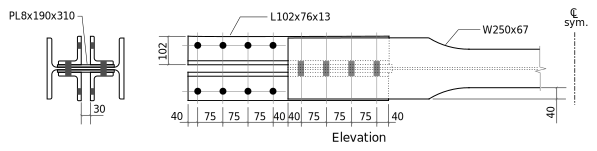
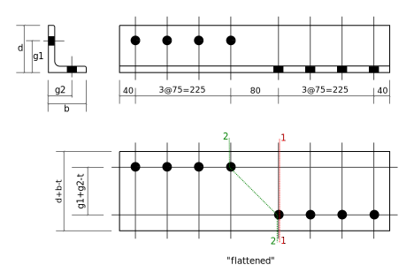

---
redirect_from:
  - "tension/t20/w-brace-01"
interact_link: content/tension/T20/W-brace-01.ipynb
kernel_name: python3
has_widgets: false
title: 'W Brace'
prev_page:
  url: /tension/T15/bolted-single-angle-01u
  title: '1 or 2 Angles, Bolted One Leg'
next_page:
  url: /tension/T30/HSS-brace-01
  title: 'HSS Brace'
comment: "***PROGRAMMATICALLY GENERATED, DO NOT EDIT. SEE ORIGINAL FILES IN /content***"
---

# W Brace with Reduced cross-section

This example shows the computation of the factored tension resistance of a W shape used as a tension
member in a lateral brace in a building such as that shown in the following photo.  There are 4 braces
shown.  Note that the upper left brace has the flange tips removed from the W-shape (to ensure 
ductility under seismic forces).  We will compute the strength of a brace similar to that shown
in the photo.


Note that this was given as problem PA2, Jan 22, 2015.

## Problem Statement

Compute the factored tension resistance, $T_r$, of the following assembly.  Steel is G40.21 350W and bolts are 3/4" ASTM A325 in 22mm punched holes.



Note that 40mm is cut from each flange tip of the W250x67.

<div markdown="1" class="cell code_cell">
<div class="input_area" markdown="1">
```python
from Designer import show, DesignNotes, SST
notes = DesignNotes('Tr',trace=True)
```
</div>

</div>

## Angles

<div markdown="1" class="cell code_cell">
<div class="input_area" markdown="1">
```python
Fy = 350
Fu = 450
d,b,t,Ag = SST.section('L102x76x13','D,B,T,A')
bd = 25.4 * 3/4   # bolt size, mm
ha = 22 + 2  # hole allowance  - punched holes
g1 = 65      # gauge, longer leg
g2 = 45      # gauge, shorter leg
show('d,b,t,Ag,bd,ha,g1,g2')
```
</div>

<div class="output_wrapper" markdown="1">
<div class="output_subarea" markdown="1">
{:.output_stream}
```
d  = 102   
b  = 76.2  
t  = 12.7  
Ag = 2100  
bd = 19.05 
ha = 24    
g1 = 65    
g2 = 45    
```
</div>
</div>
</div>



### Check Details (TO BE DONE!)
* Bolt spacings, edge distances
* Fit within flanges (need gusset thickness)

### Net Section Fracture:

<div markdown="1" class="cell code_cell">
<div class="input_area" markdown="1">
```python
# gross width = "flattened" width of angle:
wg = d + b - t

# failure path 1-1: 1 hole
wn1 = wg - 1*ha

# failure path 2-2: 2 holes
g = g1 + g2 - t
s = 80
wn2 = wg - 2*ha + s**2/(4*g)

wn = min(wn1,wn2)
show('wg,g,s,wn1,wn2,wn')
```
</div>

<div class="output_wrapper" markdown="1">
<div class="output_subarea" markdown="1">
{:.output_stream}
```
wg  = 165.5 
g   = 97.3  
s   = 80    
wn1 = 141.5 
wn2 = 133.9 
wn  = 133.9 
```
</div>
</div>
</div>

<div markdown="1" class="cell code_cell">
<div class="input_area" markdown="1">
```python
An = wn*t
Ane = 0.8*An   # S16-14: 12.3.3.2 (b) (i) - connected 1 leg 4 lines of bolts
phiu = 0.75
Tr = 4. * phiu*Ane*Fu * 1E-3     # S16-14: 13.2 a) iii)
notes.record(Tr,'Net section fracture, 4 angles','An,Ane,Tr,Fu');
```
</div>

<div class="output_wrapper" markdown="1">
<div class="output_subarea" markdown="1">
{:.output_stream}
```
    Net section fracture, 4 angles: Tr = 1837
       (An=1701, Ane=1361, Fu=450)
```
</div>
</div>
</div>

### Gross Section Yield:

<div markdown="1" class="cell code_cell">
<div class="input_area" markdown="1">
```python
phi = 0.9
Tr = 4. * phi*Ag*Fy * 1E-3    # S16-14: 13.2 a) i)
notes.record(Tr,'Gross section yield, 4 angles','Ag,Tr');
```
</div>

<div class="output_wrapper" markdown="1">
<div class="output_subarea" markdown="1">
{:.output_stream}
```
    Gross section yield, 4 angles: Tr = 2646
       (Ag=2100)
```
</div>
</div>
</div>

### Block Shear

<div markdown="1" class="cell code_cell">
<div class="input_area" markdown="1">
```python
Agv = (40. + 3*75.)*t
An = (min(d-g1,b-g2) - ha/2.)*t
Ut = 0.3
phiu = 0.75
Tr = 4. * phiu*(Ut*An*Fu + 0.6*Agv*(Fy+Fu)/2.) * 1E-3
notes.record(Tr,'Block shear, 4 angles','Ut,An,Agv,Tr');
```
</div>

<div class="output_wrapper" markdown="1">
<div class="output_subarea" markdown="1">
{:.output_stream}
```
    Block shear, 4 angles: Tr = 2522
       (Ut=0.3, An=243.8, Agv=3366)
```
</div>
</div>
</div>

## Tr for W Shape


<div markdown="1" class="cell code_cell">
<div class="input_area" markdown="1">
```python
Fy = 350.
Fu = 450.
Ag,b,d,t,w = SST.section('W250x67',properties='A,B,D,T,W')
show('Ag,b,d,t,w,Fy,Fu')
```
</div>

<div class="output_wrapper" markdown="1">
<div class="output_subarea" markdown="1">
{:.output_stream}
```
Ag = 8550 
b  = 204  
d  = 257  
t  = 15.7 
w  = 8.9  
Fy = 350  
Fu = 450  
```
</div>
</div>
</div>

<div markdown="1" class="cell code_cell">
<div class="input_area" markdown="1">
```python
wp = 190   # width of web reinforcing PL
tp = 8     # thickness of web reinforcing PL
wc = 40    # width cut from flange tips
```
</div>

</div>

### Net section fracture

<div markdown="1" class="cell code_cell">
<div class="input_area" markdown="1">
```python
# Path 1-1: net = gross  +  plates  -  holes
An = Ag  +  2*tp*wp   -  2*ha*(w+tp+tp)
Ane = 0.85*An    # S16-14: 12.3.3.2 (c) (i)
phiu = 0.75
Tr = phiu*Ane*Fu * 1E-3
notes.record(Tr,'Net section fracture, W shape','An,Ane,Tr');
```
</div>

<div class="output_wrapper" markdown="1">
<div class="output_subarea" markdown="1">
{:.output_stream}
```
    Net section fracture, W shape: Tr = 2982
       (An=10390, Ane=8836)
```
</div>
</div>
</div>

### Gross section yield

<div markdown="1" class="cell code_cell">
<div class="input_area" markdown="1">
```python
Agr = Ag - 4*wc*t   # reduced area due to flange cuts
phi = 0.9
Tr = phi*Fy*Agr * 1E-3     # S16-14: 13.2 a) i)
notes.record(Tr,'Gross section yield, W shape','Agr,Tr');
```
</div>

<div class="output_wrapper" markdown="1">
<div class="output_subarea" markdown="1">
{:.output_stream}
```
    Gross section yield, W shape: Tr = 1902
       (Agr=6038)
```
</div>
</div>
</div>

### Block Shear

<div markdown="1" class="cell code_cell">
<div class="input_area" markdown="1">
```python
T = w + tp + tp          # thickness of web + reinforcing plates
Agv = 2*(40 + 3*75)*T
An = (g2 + g2 + 25 - ha)*T   # estimate 25mm spacing between angles (gusset thickness)
Ut = 1.0
phiu = 0.75
Tr = phiu*(Ut*An*Fu + 0.6*Agv*(Fy+Fu)/2.) * 1E-3       # S16-14: 13.11
notes.record(Tr,'Block shear, W shape','T,Ut,An,Agv,Tr');
```
</div>

<div class="output_wrapper" markdown="1">
<div class="output_subarea" markdown="1">
{:.output_stream}
```
    Block shear, W shape: Tr = 3140
       (T=24.9, Ut=1.0, An=2266, Agv=13200)
```
</div>
</div>
</div>

### Tearout

<div markdown="1" class="cell code_cell">
<div class="input_area" markdown="1">
```python
Agv = 4*(40 + 3*75)*T
An = 0.
Ut = 1.0
phiu = 0.75
Tr = phiu*(Ut*An*Fu + 0.6*Agv*(Fy+Fu)/2.) * 1E-3      # S16-14: 13.11
notes.record(Tr,'Tearout, W shape','Ut,An,Agv,Tr');
```
</div>

<div class="output_wrapper" markdown="1">
<div class="output_subarea" markdown="1">
{:.output_stream}
```
    Tearout, W shape: Tr = 4751
       (Ut=1.0, An=0, Agv=26390)
```
</div>
</div>
</div>

## Summary

<div markdown="1" class="cell code_cell">
<div class="input_area" markdown="1">
```python
notes.summary()
```
</div>

<div class="output_wrapper" markdown="1">
<div class="output_subarea" markdown="1">
{:.output_stream}
```

Summary of DesignNotes for Tr
=============================

Values of Tr:
-------------
    Net section fracture, 4 angles: Tr = 1840  <-- governs
    Gross section yield, 4 angles:  Tr = 2650
    Block shear, 4 angles:          Tr = 2520
    Net section fracture, W shape:  Tr = 2980
    Gross section yield, W shape:   Tr = 1900
    Block shear, W shape:           Tr = 3140
    Tearout, W shape:               Tr = 4750

    Governing Value:
    ----------------
       Tr = 1840
```
</div>
</div>
</div>

## To do:

- check bolt detailing
- check fit of angles between flanges
- bolts, shear
- bolts, bearing
- weld, reinforcing plates to web

## Notes
* Note that gross section yield of the W should govern, but it does not by a small margin.  One thing to try would be slightly larger angles. Perhaps L127x76x13 (which would not require any additional space between flanges).  Or could shave a few more millimeters from flange tips.  Of course, all this has to be compared with factored applied loads.
