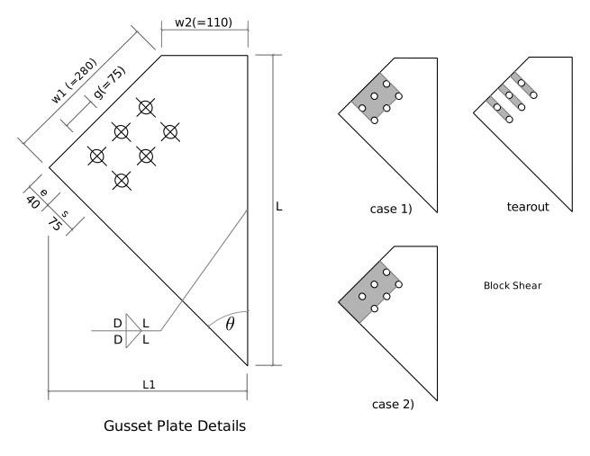
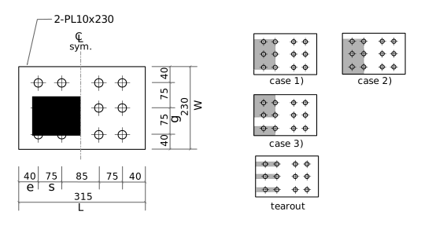
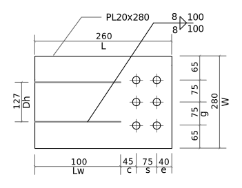
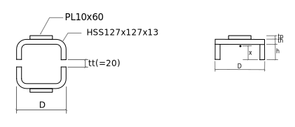

---
redirect_from:
  - "tension/t30/hss-brace-01"
interact_link: content/tension/T30/HSS-brace-01.ipynb
kernel_name: python3
has_widgets: false
title: 'HSS Brace'
prev_page:
  url: /tension/T20/W-brace-01
  title: 'W Brace'
next_page:
  url: 
  title: ''
comment: "***PROGRAMMATICALLY GENERATED, DO NOT EDIT. SEE ORIGINAL FILES IN /content***"
---

# HSS Brace Analysis
The photo shows the end details of a typical brace in a 4-storey steel structure.  This was photographed in Ottawa, in September, 2015.

This notebook shows the computations necessary to compute the factored tension resistance, $T_r$, for a similar brace.  **Note**, all of the dimensions and properties were invented by the author of this notebook; no attempt has been made to have an accurate model of the real structure.


<div markdown="1" class="cell code_cell">
<div class="input_area" markdown="1">
```python
from Designer import DesignNotes, SST, Part
import math
sind = lambda deg: math.sin(math.radians(deg))
cosd = lambda deg: math.cos(math.radians(deg))
```
</div>

</div>

<div markdown="1" class="cell code_cell">
<div class="input_area" markdown="1">
```python
phiw = 0.67
phiu = 0.75
phib = 0.80
phibr = 0.80
phi = 0.90
```
</div>

</div>

<div markdown="1" class="cell code_cell">
<div class="input_area" markdown="1">
```python
notes = DesignNotes('Tr',title='Typical HSS Cross Brace',units='kN',trace=True)

# useful abbreviations:
REQ = notes.require       # a requirement
CHK = notes.check         # a check
REC = notes.record        # record calculation details
```
</div>

</div>

## Design Parameters

<div markdown="1" class="cell code_cell">
<div class="input_area" markdown="1">
```python
Bolts = Part('Bolts',
        grade = 'ASTM A325M',
        size = '3/4"',
        Fub = 825.,
        d = 25.4*3/4,
        holes = 'punched',
        hd = 22.,
        ha = 24.,          
        threads_intercepted = True,
        nlines = 2,      # a line is perpendicular to load
        nperline = 3,    # number of bolts in each line
        g = 75.,         # gauge (perpendicular to load)
        s = 75.,         # spacing (parallel to load)
          )

Welds = Part('Welds',
        grade = 'E49xx',
        Xu = 490.,
        matching = True,
          )

Plates = Part('Plates',
        grade = 'CSA G40.21 350W',
        Fy = 350.,
        Fu = 450.,
          )

HSS = Part('HSS',
        grade = 'CSA G40.21 350W',
        size = 'HS127x127x13',
        Fy = 350.,
        Fu = 450.,
          )    

CoverPlate = Part('CoverPlate',
          T = 10.,
          W = 60.,
          Lw = 90.,     # length of weld from net section to end of HSS
          D = 6.,        # size of weld from on HSS.
          )
    
Tongue = Part('Tongue',
        T = 20.,
        W = 280.,
        L = 260.,
        e = 40.,
          )

Gusset = Part('Gusset',
        W1 = Tongue.W,
        W2 = 110.,
        T = Tongue.T,
        e = 40.,    # end distance
        D = 8.,     # weld size
        theta = 45.,         
         )
```
</div>

</div>

## Bollting and Welding Details

TBD: Here we should check all spacings, edge distances, etc.

## Gusset Plate


### Gusset to HSS Weld

<div markdown="1" class="cell code_cell">
<div class="input_area" markdown="1">
```python
w1,w2,D,theta = Gusset['W1,W2,D,theta']
Xu = Welds.Xu

L1 = w2+w1*cosd(theta)
L = (L1/sind(theta))*cosd(theta) + w1*sind(theta)

Mw = 1.0
Aw = 2*L*.707*D
Vr = 0.67*phiw*Aw*Xu*(1+sind(theta)**1.5)*Mw * 1E-3

REC(Vr,'Gusset to HSS Weld','w1,w2,L1,L,D,theta,Aw,Mw,phiw,Vr');
```
</div>

<div class="output_wrapper" markdown="1">
<div class="output_subarea" markdown="1">
{:.output_stream}
```
    Gusset to HSS Weld: Tr = 2008 kN
       (w1=280.0, w2=110.0, L1=308.0, L=506.0, D=8.0, theta=45.0, Aw=5724, Mw=1.0, phiw=0.67, Vr=2008)
```
</div>
</div>
</div>

### Gusset Block Shear
Because the gusset must be the same thickness as the tongue, and as the edges align so they are the
same width (mostly), the block shear strengths determined here should be the same.  So this section is not
really necessary.  The tongue does have one more pattern (Pattern 3)) that is judged not applicable
here because of the increased width of the gusset.
#### Block Shear Case 1)

<div markdown="1" class="cell code_cell">
<div class="input_area" markdown="1">
```python
nlines,nperline,g,s,e,t,ha,Fy,Fu = (Bolts+Plates+Gusset)['nlines,nperline,g,s,e,T,ha,Fy,Fu']

An = t*((nperline-1)*g - (nperline-1)*ha)
Agv = 2*t*((nlines-1)*s + e)
Ut = 1.0
Vr = phiu*(Ut*An*Fu + 0.6*Agv*(Fy+Fu)/2.) * 1E-3
REC(Vr,'Gusset Block Shear Case 1)','Ut,An,Agv,Fy,Fu,Vr');
```
</div>

<div class="output_wrapper" markdown="1">
<div class="output_subarea" markdown="1">
{:.output_stream}
```
    Gusset Block Shear Case 1): Tr = 1516 kN
       (Ut=1.0, An=2040, Agv=4600, Fy=350.0, Fu=450.0, Vr=1516)
```
</div>
</div>
</div>

#### Block Shear Case 2)

<div markdown="1" class="cell code_cell">
<div class="input_area" markdown="1">
```python
edge = (w1 - (nperline-1)*g)/2.
An = (((nperline-1)*g+edge)-(nperline-0.5)*ha)*t
Agv = t*((nlines-1)*s + e)
Ut = 0.8
Vr = phiu*(Ut*An*Fu + 0.6*Agv*(Fy+Fu)/2.) * 1E-3
REC(Vr,'Gusset Block Shear Case 2)','edge,Ut,An,Agv,Vr');
```
</div>

<div class="output_wrapper" markdown="1">
<div class="output_subarea" markdown="1">
{:.output_stream}
```
    Gusset Block Shear Case 2): Tr = 1251 kN
       (edge=65.0, Ut=0.8, An=3100, Agv=2300, Vr=1251)
```
</div>
</div>
</div>

#### Tearout

<div markdown="1" class="cell code_cell">
<div class="input_area" markdown="1">
```python
Agv = t*((nlines-1)*s + e) * nperline * 2
Vr = phiu * 0.6*Agv*(Fy+Fu)/2. * 1E-3
REC(Vr,'Gusset tearout','Agv,Vr');
```
</div>

<div class="output_wrapper" markdown="1">
<div class="output_subarea" markdown="1">
{:.output_stream}
```
    Gusset tearout: Tr = 2484 kN
       (Agv=13800, Vr=2484)
```
</div>
</div>
</div>

## Lap Plates (2)
### Lap Plate Details
Consider the thickness of both plates together when computing the resistance.
As the plate is symmetric, we only have to investigate one end.



<div markdown="1" class="cell code_cell">
<div class="input_area" markdown="1">
```python
LapPlates = Part('LapPlates',
            W = 230.,
            L = 315.,
            T = 10.*2.,      # include 2 plates
            e = 40.,         # could be different than gusset
            )
LapPlates.setfrom('g,s,nlines,nperline',Bolts) # must be the same as bolt group
```
</div>

</div>

### Lap Plates: Gross Section Yield

<div markdown="1" class="cell code_cell">
<div class="input_area" markdown="1">
```python
wg,t,Fy = (Plates+LapPlates)['W,T,Fy']
Ag = wg*t
Tr = phi*Ag*Fy * 1E-3
REC(Tr,'Lap Plates, Gross Yield','wg,t,Ag,Fy,phi');
```
</div>

<div class="output_wrapper" markdown="1">
<div class="output_subarea" markdown="1">
{:.output_stream}
```
    Lap Plates, Gross Yield: Tr = 1449 kN
       (wg=230.0, t=20.0, Ag=4600, Fy=350.0, phi=0.9)
```
</div>
</div>
</div>

### Lap Plates: Net Section Fracture

<div markdown="1" class="cell code_cell">
<div class="input_area" markdown="1">
```python
wg,t,nperline,ha,Fu = (Bolts+Plates+LapPlates)['W,T,nperline,ha,Fu']

wn = wg - nperline*ha
Ane = An = wn*t
Tr = phiu*Ane*Fu * 1E-3
REC(Tr,'Lap Plates, Net Fracture','wg,ha,wn,phiu,Ane,Fu');
```
</div>

<div class="output_wrapper" markdown="1">
<div class="output_subarea" markdown="1">
{:.output_stream}
```
    Lap Plates, Net Fracture: Tr = 1066 kN
       (wg=230.0, ha=24.0, wn=158.0, phiu=0.75, Ane=3160, Fu=450.0)
```
</div>
</div>
</div>

### Lap Plates: Block Shear
#### Block Shear Case 1)

<div markdown="1" class="cell code_cell">
<div class="input_area" markdown="1">
```python
g,t,nperline,nlines,e,s = LapPlates['g,T,nperline,nlines,e,s']
ha = Bolts.ha
Fy,Fu = Plates['Fy,Fu']

An = ((nperline-1)*g - (nperline-1)*ha)*t
Agv = (e + (nlines-1)*s)*t*2
Ut = 1.0
Vr = phiu*(Ut*An*Fu + 0.6*Agv*(Fy+Fu)/2.) * 1E-3
REC(Vr,'Lap Plates, Block Shear Case 1)','An,Agv,Ut,Fy,Fu,Vr');
```
</div>

<div class="output_wrapper" markdown="1">
<div class="output_subarea" markdown="1">
{:.output_stream}
```
    Lap Plates, Block Shear Case 1): Tr = 1516 kN
       (An=2040, Agv=4600, Ut=1.0, Fy=350.0, Fu=450.0, Vr=1516)
```
</div>
</div>
</div>

#### Case 2)

<div markdown="1" class="cell code_cell">
<div class="input_area" markdown="1">
```python
g,t,nperline,nlines,e,s,wg = LapPlates['g,T,nperline,nlines,e,s,W']
ha = Bolts.ha
Fy,Fu = Plates['Fy,Fu']

edge = (wg - (nperline-1)*g)/2.0
An = (wg - (edge-ha/2) - nperline*ha)*t
Agv = (e + (nlines-1)*s)*t
Ut = 0.8
Vr = phiu*(Ut*An*Fu + 0.6*Agv*(Fy+Fu)/2.) * 1E-3
REC(Vr,'Lap Plates, Block Shear Case 2)','wg,edge,An,Agv,Ut,Vr');
```
</div>

<div class="output_wrapper" markdown="1">
<div class="output_subarea" markdown="1">
{:.output_stream}
```
    Lap Plates, Block Shear Case 2): Tr = 1116 kN
       (wg=230.0, edge=40.0, An=2600, Agv=2300, Ut=0.8, Vr=1116)
```
</div>
</div>
</div>

#### Case 3)

<div markdown="1" class="cell code_cell">
<div class="input_area" markdown="1">
```python
g,t,nperline,nlines,e,s,wg = LapPlates['g,T,nperline,nlines,e,s,W']
ha = Bolts.ha
Fy,Fu = Plates['Fy,Fu']

An = (wg - nperline*ha - (g-ha))*t
Agv = (e + (nlines-1)*s)*t * 2.
Ut = 0.6
Vr = phiu*(Ut*An*Fu + 0.6*Agv*(Fy+Fu)/2.) * 1E-3
REC(Vr,'Lap Plates, Block Shear Case 3)','An,Agv,Ut,Vr');
```
</div>

<div class="output_wrapper" markdown="1">
<div class="output_subarea" markdown="1">
{:.output_stream}
```
    Lap Plates, Block Shear Case 3): Tr = 1261 kN
       (An=2140, Agv=4600, Ut=0.6, Vr=1261)
```
</div>
</div>
</div>

#### Tearout

<div markdown="1" class="cell code_cell">
<div class="input_area" markdown="1">
```python
t,nlines,nperline,e,s = LapPlates['T,nlines,nperline,e,s']
Fy,Fu = Plates['Fy,Fu']

An = 0
Agv = (e + (nlines-1)*s)*t*2*nperline
Ut = 1
Vr = phiu*(Ut*An*Fu + 0.6*Agv*(Fy+Fu)/2.) * 1E-3
REC(Vr,'Lap Plates, tearout','Agv,Vr');
```
</div>

<div class="output_wrapper" markdown="1">
<div class="output_subarea" markdown="1">
{:.output_stream}
```
    Lap Plates, tearout: Tr = 2484 kN
       (Agv=13800, Vr=2484)
```
</div>
</div>
</div>

## Tongue Plate
### Tongue Plate Details


<div markdown="1" class="cell code_cell">
<div class="input_area" markdown="1">
```python
Tongue.set(
        W = Gusset.W1,
        T = Gusset.T,
        D = 8.,
        nlines = Bolts.nlines,
        nperline = Bolts.nperline,
        e = 40.,
        s = Bolts.s,
        g = Bolts.g,
        c = 45.,
        L = 260.              
        )
Tongue.set(
      Lw = Tongue.L - (Tongue.c + (Tongue.nlines-1)*Tongue.s + Tongue.e),
      Dh = SST.section(HSS.size,'D'),
     )
```
</div>

</div>

### Tongue Plate: Bolted End
#### Gross Section Yield

<div markdown="1" class="cell code_cell">
<div class="input_area" markdown="1">
```python
wg,t = Tongue['W,T']
Fy = Plates['Fy']
Ag = wg*t
Tr = phi*Ag*Fy * 1E-3
REC(Tr,'Tongue Plate, Gross Yield','wg,t,Ag,Fy');
```
</div>

<div class="output_wrapper" markdown="1">
<div class="output_subarea" markdown="1">
{:.output_stream}
```
    Tongue Plate, Gross Yield: Tr = 1764 kN
       (wg=280.0, t=20.0, Ag=5600, Fy=350.0)
```
</div>
</div>
</div>

#### Net Section Fracture

<div markdown="1" class="cell code_cell">
<div class="input_area" markdown="1">
```python
wg,t,n = Tongue['W,T,nperline']
Fu = Plates.Fu
ha = Bolts.ha

wn = wg - n*ha
Ane = An = wn*t
Tr = phiu*Ane*Fu * 1E-3
REC(Tr,'Tongue Plate, Bolted End, Net Section Fracture','wg,wn,Ane,Fu');
```
</div>

<div class="output_wrapper" markdown="1">
<div class="output_subarea" markdown="1">
{:.output_stream}
```
    Tongue Plate, Bolted End, Net Section Fracture: Tr = 1404 kN
       (wg=280.0, wn=208.0, Ane=4160, Fu=450.0)
```
</div>
</div>
</div>

#### Block Shear, Case 1)

<div markdown="1" class="cell code_cell">
<div class="input_area" markdown="1">
```python
g,t,nperline,nlines,e,s = Tongue['g,T,nperline,nlines,e,s']
ha = Bolts.ha
Fy,Fu = Plates['Fy,Fu']

An = ((nperline-1)*g - (nperline-1)*ha)*t
Agv = (e + (nlines-1)*s)*t*2
Ut = 1.0
Vr = phiu*(Ut*An*Fu + 0.6*Agv*(Fy+Fu)/2.) * 1E-3
REC(Vr,'Tongue Plate, Block Shear Case 1)','An,Agv,Ut,Fy,Fu,Vr');
```
</div>

<div class="output_wrapper" markdown="1">
<div class="output_subarea" markdown="1">
{:.output_stream}
```
    Tongue Plate, Block Shear Case 1): Tr = 1516 kN
       (An=2040, Agv=4600, Ut=1.0, Fy=350.0, Fu=450.0, Vr=1516)
```
</div>
</div>
</div>

#### Block Shear, Case 2)

<div markdown="1" class="cell code_cell">
<div class="input_area" markdown="1">
```python
g,t,nperline,nlines,e,s,wg = Tongue['g,T,nperline,nlines,e,s,W']
ha = Bolts.ha
Fy,Fu = Plates['Fy,Fu']

edge = (wg - (nperline-1)*g)/2.0
An = (wg - (edge-ha/2.) - nperline*ha)*t
Agv = (e + (nlines-1)*s)*t
Ut = 0.8
Vr = phiu*(Ut*An*Fu + 0.6*Agv*(Fy+Fu)/2.) * 1E-3
REC(Vr,'Tongue Plate, Block Shear Case 2)','edge,An,Agv,Ut,Vr');
```
</div>

<div class="output_wrapper" markdown="1">
<div class="output_subarea" markdown="1">
{:.output_stream}
```
    Tongue Plate, Block Shear Case 2): Tr = 1251 kN
       (edge=65.0, An=3100, Agv=2300, Ut=0.8, Vr=1251)
```
</div>
</div>
</div>

#### Block Shear, Case 3)

<div markdown="1" class="cell code_cell">
<div class="input_area" markdown="1">
```python
g,t,nperline,nlines,e,s,wg = Tongue['g,T,nperline,nlines,e,s,W']
ha = Bolts.ha
Fy,Fu = Plates['Fy,Fu']

An = (wg - nperline*ha - (g-ha))*t
Agv = (e + (nlines-1)*s)*t * 2.
Ut = 0.6
Vr = phiu*(Ut*An*Fu + 0.6*Agv*(Fy+Fu)/2.) * 1E-3
REC(Vr,'Tongue Plate, Block Shear Case 3)','An,Agv,Ut,Vr');
```
</div>

<div class="output_wrapper" markdown="1">
<div class="output_subarea" markdown="1">
{:.output_stream}
```
    Tongue Plate, Block Shear Case 3): Tr = 1464 kN
       (An=3140, Agv=4600, Ut=0.6, Vr=1464)
```
</div>
</div>
</div>

#### Block Shear, Tearout

<div markdown="1" class="cell code_cell">
<div class="input_area" markdown="1">
```python
t,nlines,nperline,e,s = Tongue['T,nlines,nperline,e,s']
Fy,Fu = Plates['Fy,Fu']

An = 0
Agv = (e + (nlines-1)*s)*t*2*nperline
Ut = 1
Vr = phiu*(Ut*An*Fu + 0.6*Agv*(Fy+Fu)/2.) * 1E-3
REC(Vr,'Tongue Plate tearout','Agv,Vr');
```
</div>

<div class="output_wrapper" markdown="1">
<div class="output_subarea" markdown="1">
{:.output_stream}
```
    Tongue Plate tearout: Tr = 2484 kN
       (Agv=13800, Vr=2484)
```
</div>
</div>
</div>

### Tongue Plate: Welded End
#### Shear Lag - Effective Net Area

<div markdown="1" class="cell code_cell">
<div class="input_area" markdown="1">
```python
w,w2,L,t,n,g = Tongue['W,Dh,Lw,T,nperline,g']
Fu = Plates.Fu
if L >= 2*w2:             # 12.3.3.3 b)
    An2 = 1.00*w2*t
elif L >= w2:
    An2 = 0.5*w2*t + 0.25*L*t
else:
    An2 = 0.75*L*t
    
w3 = (w-w2)/2.            # 12.3.3.3 c)
xbar = w3/2.
if L >= w3:
    An3 = (1.-xbar/L)*w3*t
else:
    An3 = 0.50*L*t
Ane = An2 + An3 + An3
Tr = phiu*Ane*Fu * 1E-3
REC(Tr,'Tongue Plate, Welded End, Net Section Fracture','w2,w3,An2,An3,Ane');
```
</div>

<div class="output_wrapper" markdown="1">
<div class="output_subarea" markdown="1">
{:.output_stream}
```
    Tongue Plate, Welded End, Net Section Fracture: Tr = 1144 kN
       (w2=127.0, w3=76.5, An2=1500, An3=944.8, Ane=3390)
```
</div>
</div>
</div>

## Fasteners
### Bolts
#### Shear

<div markdown="1" class="cell code_cell">
<div class="input_area" markdown="1">
```python
d,Fu,threads_intercepted = Bolts['d,Fub,threads_intercepted']
t = min(Gusset.T,Tongue.T,2*LapPlates.T)
n = min(Bolts.nlines*Bolts.nperline,Tongue.nlines*Tongue.nperline)
m = 2
Ab = 3.14159*d*d/4.
Vr = 0.6*phib*n*m*Ab*Fu * 1E-3
if threads_intercepted:
    Vr = 0.7*Vr
REC(Vr,'Bolts in Shear','n,m,d,Ab,Fu,Vr');
```
</div>

<div class="output_wrapper" markdown="1">
<div class="output_subarea" markdown="1">
{:.output_stream}
```
    Bolts in Shear: Tr = 948.1 kN
       (n=6, m=2, d=19.05, Ab=285.0, Fu=825.0, Vr=948.1)
```
</div>
</div>
</div>

#### Bearing

<div markdown="1" class="cell code_cell">
<div class="input_area" markdown="1">
```python
Br = 3*phibr*n*t*d*Fu * 1E-3
REC(Br,'Bolts in Bearing','n,t,d,Fu');
```
</div>

<div class="output_wrapper" markdown="1">
<div class="output_subarea" markdown="1">
{:.output_stream}
```
    Bolts in Bearing: Tr = 4526 kN
       (n=6, t=20.0, d=19.05, Fu=825.0)
```
</div>
</div>
</div>

### Welds - HSS to Tongue Plate

<div markdown="1" class="cell code_cell">
<div class="input_area" markdown="1">
```python
L,D = Tongue['Lw,D']
Xu,matching = Welds['Xu,matching']
Aw = 4.*L*D*0.707
Vr = 0.67*phiw*Aw*Xu * 1E-3
if matching:
    REC(Vr,'Fillet Weld (HSS to Plate)','D,L,Aw,Xu')
else:
    raise Exception('Non matching electrodes')
```
</div>

<div class="output_wrapper" markdown="1">
<div class="output_subarea" markdown="1">
{:.output_stream}
```
    Fillet Weld (HSS to Plate): Tr = 497.6 kN
       (D=8.0, L=100.0, Aw=2262, Xu=490.0)
```
</div>
</div>
</div>

## HSS + Cover Plate


### Net Section Fracture

<div markdown="1" class="cell code_cell">
<div class="input_area" markdown="1">
```python
dsg,Fy,Fu = HSS['size,Fy,Fu']
D,th,A = SST.section(dsg,'D,T,A')
tp,wp = CoverPlate['T,W']
tt = Tongue.T   # thickness of tongue
Lw = Tongue.Lw  # length of one weld
h = D/2. - th - tt/2.
xbar = (2.*h*th*h/2. + D*th*(h+th/2.) + wp*tp*(h+th+tp/2.))/(2*h*th + D*th + wp*tp)
Ag = A + 2*wp*tp       # HSS + cover plates
An = Ag - 2.*tt*th     # remove slots cut for tongue
if xbar/Lw > 0.1:                 # 12.3.3.4
    Ane = (1.1 - xbar/Lw)*An
else:
    Ane = An
Tr = phiu*Ane*Fu * 1E-3
REC(Tr,'HSS Net Section Fracture','xbar,Lw,D,th,A,Ag,An,Ane,Fu');
```
</div>

<div class="output_wrapper" markdown="1">
<div class="output_subarea" markdown="1">
{:.output_stream}
```
    HSS Net Section Fracture: Tr = 1422 kN
       (xbar=40.71, Lw=100.0, D=127.0, th=12.7, A=5390, Ag=6590, An=6082, Ane=4214, Fu=450.0)
```
</div>
</div>
</div>

### Gross Section Yield

<div markdown="1" class="cell code_cell">
<div class="input_area" markdown="1">
```python
Ag = A
Tr = phi*Ag*Fy  * 1E-3
REC(Tr,'HSS Gross Section Yield','Ag,Fy');
```
</div>

<div class="output_wrapper" markdown="1">
<div class="output_subarea" markdown="1">
{:.output_stream}
```
    HSS Gross Section Yield: Tr = 1698 kN
       (Ag=5390, Fy=350.0)
```
</div>
</div>
</div>

## Cover Plate to HSS Weld
Ensure that the length of the weld can develop the full strength of the cover plate.

<div markdown="1" class="cell code_cell">
<div class="input_area" markdown="1">
```python
T,W,L,D = CoverPlate['T,W,Lw,D']
Xu = Welds.Xu
Fy,Fu = Plates['Fy,Fu']

Aw = 0.707*D*L*2.
Vr = 0.67*phiw*Aw*Xu*1*1 * 1E-3     # 13.13.2.2
Tr = phi*(T*W)*Fy * 1E-3            # gross section yield

CHK(Vr>=Tr,'Coverplate weld strength, gross yield','L,D,Aw,Vr,Tr')

An = W*T                             # 12.3.3.3 b)
if L >= 2*w:
    An2 = W*T
elif L >= W:
    An2 = 0.5*W*T + 0.25*L*T
else:
    An2 = 0.75*L*T
Ane = An2
Tr = phiu*An2*Fu * 1E-3
CHK(Vr>=Tr,'Coverplate weld strength, net fracture','L,W,An2,Ane,Vr,Tr');
```
</div>

<div class="output_wrapper" markdown="1">
<div class="output_subarea" markdown="1">
{:.output_stream}
```
    Coverplate weld strength, gross yield?  NG! *****
      (L=90.0, D=6.0, Aw=763.6, Vr=168.0, Tr=189.0)
    Coverplate weld strength, net fracture?  NG! *****
      (L=90.0, W=60.0, An2=525.0, Ane=525.0, Vr=168.0, Tr=177.2)
```
</div>
</div>
</div>

## To Do
* Check that gusset plate doesn't cause undue flexural problems in the flange of the HSS column member.

## Bolting Details

### Lap Plates

<div markdown="1" class="cell code_cell">
<div class="input_area" markdown="1">
```python
w,t,l,e,s,g,nlines,nperline = LapPlates['W,T,L,e,s,g,nlines,nperline']
minedge = 32.      # 22.3.2 Table 6, 3/4" bolt, sheared edge
minend = 32.       # 22.3.4
maxedge = min(150.,12.*t)
edge = (w - (nperline-1)*g)/2.
CHK(edge>=minedge,'Bolt min edge distance, lap plate','edge,minedge',)
CHK(edge<=maxedge,'Bolt max edge distance, lap plate','edge,maxedge',)
CHK(e>=minend,'Bolt min end distance, lap plate','e,minend',)
d = Bolts.d
minspacing = 2.7*d
CHK(s>=minspacing and g>=minspacing,'Bolt spacing, lap plate','s,g,minspacing')
```
</div>

<div class="output_wrapper" markdown="1">
<div class="output_subarea" markdown="1">
{:.output_stream}
```
    Bolt min edge distance, lap plate?  OK 
      (edge=40.0, minedge=32.0)
    Bolt max edge distance, lap plate?  OK 
      (edge=40.0, maxedge=150.0)
    Bolt min end distance, lap plate?  OK 
      (e=40.0, minend=32.0)
    Bolt spacing, lap plate?  OK 
      (s=75.0, g=75.0, minspacing=51.43)
```
</div>
</div>
<div class="output_wrapper" markdown="1">
<div class="output_subarea" markdown="1">


{:.output_data_text}
```
True
```


</div>
</div>
</div>

### Tongue Plate

<div markdown="1" class="cell code_cell">
<div class="input_area" markdown="1">
```python
# TODO
```
</div>

</div>

### Gusset Plate

<div markdown="1" class="cell code_cell">
<div class="input_area" markdown="1">
```python
# TODO
```
</div>

</div>

## Welding Details

### HSS to Tongue

<div markdown="1" class="cell code_cell">
<div class="input_area" markdown="1">
```python
# TODO
```
</div>

</div>

### Cover PLate to HSS

<div markdown="1" class="cell code_cell">
<div class="input_area" markdown="1">
```python
# TODO
```
</div>

</div>

## Summary

<div markdown="1" class="cell code_cell">
<div class="input_area" markdown="1">
```python
notes.summary()
```
</div>

<div class="output_wrapper" markdown="1">
<div class="output_subarea" markdown="1">
{:.output_stream}
```

Summary of DesignNotes for Tr: Typical HSS Cross Brace
======================================================

Checks:
-------
    Coverplate weld strength, gross yield?    NG! *****
      (L=90.0, D=6.0, Aw=763.6, Vr=168.0, Tr=189.0)
    Coverplate weld strength, net fracture?   NG! *****
      (L=90.0, W=60.0, An2=525.0, Ane=525.0, Vr=168.0, Tr=177.2)
    Bolt min edge distance, lap plate?        OK 
      (edge=40.0, minedge=32.0)
    Bolt max edge distance, lap plate?        OK 
      (edge=40.0, maxedge=150.0)
    Bolt min end distance, lap plate?         OK 
      (e=40.0, minend=32.0)
    Bolt spacing, lap plate?                  OK 
      (s=75.0, g=75.0, minspacing=51.43)

Values of Tr:
-------------
    Gusset to HSS Weld:                             Tr = 2010 kN
    Gusset Block Shear Case 1):                     Tr = 1520 kN
    Gusset Block Shear Case 2):                     Tr = 1250 kN
    Gusset tearout:                                 Tr = 2480 kN
    Lap Plates, Gross Yield:                        Tr = 1450 kN
    Lap Plates, Net Fracture:                       Tr = 1070 kN
    Lap Plates, Block Shear Case 1):                Tr = 1520 kN
    Lap Plates, Block Shear Case 2):                Tr = 1120 kN
    Lap Plates, Block Shear Case 3):                Tr = 1260 kN
    Lap Plates, tearout:                            Tr = 2480 kN
    Tongue Plate, Gross Yield:                      Tr = 1760 kN
    Tongue Plate, Bolted End, Net Section Fracture: Tr = 1400 kN
    Tongue Plate, Block Shear Case 1):              Tr = 1520 kN
    Tongue Plate, Block Shear Case 2):              Tr = 1250 kN
    Tongue Plate, Block Shear Case 3):              Tr = 1460 kN
    Tongue Plate tearout:                           Tr = 2480 kN
    Tongue Plate, Welded End, Net Section Fracture: Tr = 1140 kN
    Bolts in Shear:                                 Tr = 948 kN
    Bolts in Bearing:                               Tr = 4530 kN
    Fillet Weld (HSS to Plate):                     Tr = 498 kN  <-- governs
    HSS Net Section Fracture:                       Tr = 1420 kN
    HSS Gross Section Yield:                        Tr = 1700 kN

    Governing Value:
    ----------------
       Tr = 498 kN
```
</div>
</div>
</div>

## Notes

* The factored resistance of this component is low, governed by the weld of the HSS to the tongue plate.  Its capacity is 498 kN, almost 1/2 of the next lowest item (the shear strength of the bolts).
* To increase the overall strength, the first thing to do would be to increase length of that weld from 100mm to something considerably larger. 200mm of weld would require increasing the length of tongue from 280mm to 380mm but would double that strength at very small cost.
* The cover plate welding to the HSS may be inadequate as it is shown. Increasing the length of the HSS to tongue weld will leave space for more weld on the cover plate, up to 190mm on one side of the minimum cross-section, which should be more than enough.
* Increasing the HSS to tongue plate weld length may also increase $T_r$ for _Tongue Plate, Welded End, Net Section Fracture_ and _HSS Net Section Fracture_.
