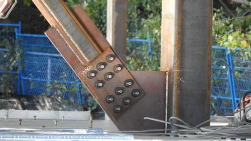
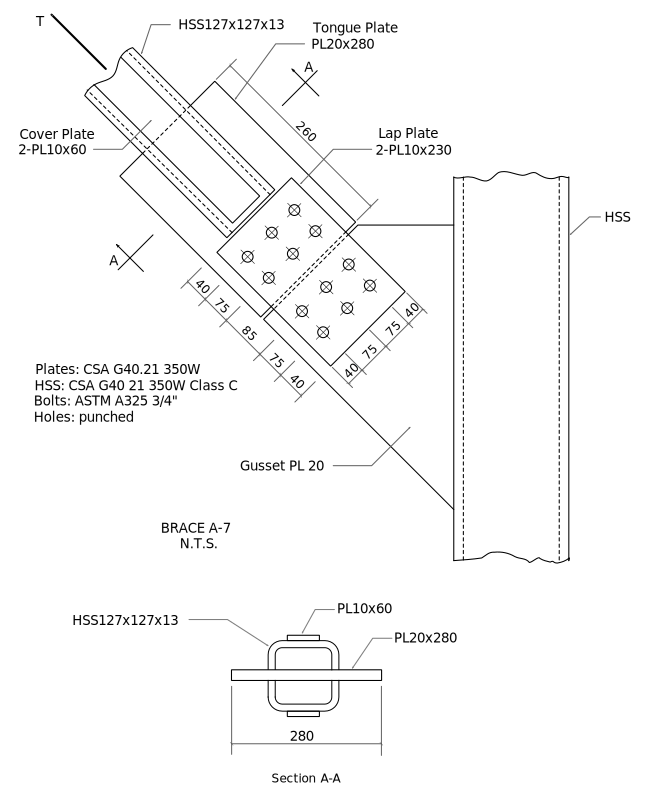
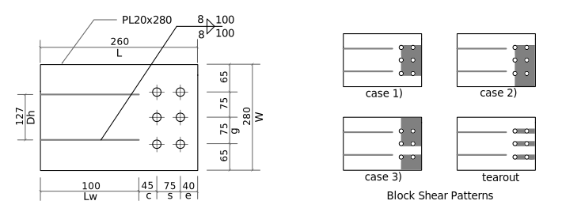
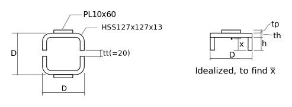

---
redirect_from:
  - "tension/t30/hss-brace-01"
interact_link: content/tension/T30/HSS-brace-01.ipynb
kernel_name: python3
has_widgets: false
title: 'HSS Brace'
prev_page:
  url: /tension/T20/W-brace-01
  title: 'W Brace'
next_page:
  url: 
  title: ''
comment: "***PROGRAMMATICALLY GENERATED, DO NOT EDIT. SEE ORIGINAL FILES IN /content***"
---

# HSS Brace Analysis
The photo shows the end details of a typical brace in a 4-storey steel structure.  This was photographed in Ottawa, in September, 2015.

This notebook shows the computations necessary to compute the factored tension resistance, $T_r$, for a similar brace.  **Note**, all of the dimensions and properties were invented by the author of this notebook; no attempt has been made to have an accurate model of the real structure.





<div markdown="1" class="cell code_cell">
<div class="input_area" markdown="1">
```python
import sys
sys.path[1:1] = ['../../ca-steel-design/lib']
from Designer import Designer, SST
import math
sind = lambda deg: math.sin(math.radians(deg))
cosd = lambda deg: math.cos(math.radians(deg))
```
</div>

</div>

<div markdown="1" class="cell code_cell">
<div class="input_area" markdown="1">
```python
def Warn(s):
    print('***** WARNING:',s,'*****')
    
def _get(dct,keys):
    ans = []
    keys = keys.split(',')
    for k in keys:
        default = None
        if '=' in k:
            k,default = k.split('=',1)
        k = k.strip()
        if k in dct:
            ans.append(dct[k])
        elif default is not None:
            ans.append(eval(default,{},dct))
        else:
            ans.append(eval(k,{},dct))
    if len(keys) == 1:
        return ans[0]
    return ans
    
    
class Namespace(object):
    
    def __init__(self,namespace):
        self.namespace = namespace
        
    def __getattr__(self,name):
        if name in self.namespace:
            return self.namespace[name]
        raise AttributeError('Attribute not found: '+name)
        
    def get(self,keys):
        return _get(self.namespace,keys)
    
    def __getitem__(self,indx):
        return self.get(indx)
    

class Data(object):
    
    def __init__(self,nooverrides=False):
        self.namespaces = {}
        self.nooverrides = nooverrides
        
    def set(self,ns,**keywds):
        if ns not in self.namespaces:
            self.namespaces[ns] = {}
        self.namespaces[ns].update(keywds)
        
    def get(self,ns,keys):
        dct = {}
        for n in ns.split(','):
            n = n.strip()
            if self.nooverrides:
                for k,v in self.namespaces[n].items():
                    if k in dct:
                        raise KeyError(f'Parameter "{k}" is multiply defined.')
                    dct[k] = v
            else:
                dct.update(self.namespaces[n])
        return _get(dct,keys)
    
    def __getitem__(self,indx):
        return self.get(indx[0],indx[1])
    
    def __getattr__(self,name):
        if name in self.namespaces:
            return Namespace(self.namespaces[name])
        raise AttributeError('Attribute not found: '+name)
```
</div>

</div>

<div markdown="1" class="cell code_cell">
<div class="input_area" markdown="1">
```python
phiw = 0.67
phiu = 0.75
phib = 0.80
phibr = 0.80
phi = 0.90
```
</div>

</div>

<div markdown="1" class="cell code_cell">
<div class="input_area" markdown="1">
```python
des = Designer(title='Typical HSS Cross Brace',var='Tr',units='kN',trace=True)

# useful abbreviations:
REQ = des.require       # a requirement
CHK = des.check         # a check
REC = des.record        # record calculation details
```
</div>

</div>

## Design Parameters

<div markdown="1" class="cell code_cell">
<div class="input_area" markdown="1">
```python
Params = Data()

Params.set('Bolts',
        grade = 'ASTM A325M',
        size = '3/4"',
        Fub = 825.,
        d = 25.4*3/4,
        holes = 'punched',
        hd = 22.,
        ha = 24.,          
        threads_intercepted = True,
        nlines = 2,      # a line is perpendicular to load
        nperline = 3,    # number of bolts in each line
        g = 75.,         # gauge (perpendicular to load)
        s = 75.,         # spacing (parallel to load)
          )

Params.set('Welds',
        grade = 'E49xx',
        Xu = 490.,
        matching = True,
          )

Params.set('Plate',
        grade = 'CSA G40.21 350W',
        Fy = 350.,
        Fu = 450.,
          )

Params.set('HSS',
        grade = 'CSA G40.21 350W',
        size = 'HS127x127x13',
        Fy = 350.,
        Fu = 450.,
          )    

Params.set('CoverPlate',
          T = 10.,
          W = 60.,
          )
    
Params.set('Tongue',
        T = 20.,
        W = 280.,
        L = 260.,
        e = 40.,
          )

Params.set('Gusset',
        W1 = Params['Tongue','W'],
        W2 = 110.,
        T = Params['Tongue','T'],
        e = 40.,    # end distance
        D = 8.,     # weld size
        theta = 45.,         
         )
```
</div>

</div>

## Bollting and Welding Details

TBD: Here we should check all spacings, edge distances, etc.

## Gusset Plate


### Gusset to HSS Weld

<div markdown="1" class="cell code_cell">
<div class="input_area" markdown="1">
```python
w1,w2,D,theta = Params['Gusset','W1,W2,D,theta']
Xu = Params['Welds','Xu']

L1 = w2+w1*cosd(theta)
L = (L1/sind(theta))*cosd(theta) + w1*sind(theta)

Mw = 1.0
Aw = 2*L*.707*D
Vr = 0.67*phiw*Aw*Xu*(1+sind(theta)**1.5)*Mw * 1E-3

REC('Gusset to HSS Weld','w1,w2,L1,L,D,theta,Aw,Mw,phiw',Tr=Vr)
```
</div>

<div class="output_wrapper" markdown="1">
<div class="output_subarea" markdown="1">
{:.output_stream}
```
    Gusset to HSS Weld: Tr = 2008 kN
       (w1=280.0, w2=110.0, L1=308.0, L=506.0, D=8.0, theta=45.0, Aw=5724, Mw=1.0, phiw=0.67)
```
</div>
</div>
</div>

### Gusset Block Shear
#### Case 1)

<div markdown="1" class="cell code_cell">
<div class="input_area" markdown="1">
```python
nlines,nperline,g,s,e,t,hd,Fy,Fu = Params['Bolts,Plate,Gusset','nlines,nperline,g,s,e,T,hd,Fy,Fu']

An = t*((nperline-1)*g - (nperline-1)*hd)
Agv = 2*t*((nlines-1)*s + e)
Ut = 1.0
Vr = phiu*(Ut*An*Fu + 0.6*Agv*(Fy+Fu)/2.) * 1E-3
REC('Gusset Block Shear Case 1)','Ut,An,Agv,Fy,Fu',Tr=Vr)
```
</div>

<div class="output_wrapper" markdown="1">
<div class="output_subarea" markdown="1">
{:.output_stream}
```
    Gusset Block Shear Case 1): Tr = 1544 kN
       (Ut=1.0, An=2120, Agv=4600, Fy=350.0, Fu=450.0)
```
</div>
</div>
</div>

#### Case 2)

<div markdown="1" class="cell code_cell">
<div class="input_area" markdown="1">
```python
An = t*((nperline-1)*g + ((w1/2.)-(nperline-1)*g/2.))
Agv = t*((nlines-1)*s + e)
Ut = 0.8
Vr = phiu*(Ut*An*Fu + 0.6*Agv*(Fy+Fu)/2.) * 1E-3
REC('Gusset Block Shear Case 2)','Ut,An,Agv',Tr=Vr)
```
</div>

<div class="output_wrapper" markdown="1">
<div class="output_subarea" markdown="1">
{:.output_stream}
```
    Gusset Block Shear Case 2): Tr = 1575 kN
       (Ut=0.8, An=4300, Agv=2300)
```
</div>
</div>
</div>

#### Tearout

<div markdown="1" class="cell code_cell">
<div class="input_area" markdown="1">
```python
Agv = t*((nlines-1)*s + e) * nperline * 2
Vr = phiu * 0.6*Agv*(Fy+Fu)/2. * 1E-3
REC('Gusset tearout','Agv',Tr=Vr)
```
</div>

<div class="output_wrapper" markdown="1">
<div class="output_subarea" markdown="1">
{:.output_stream}
```
    Gusset tearout: Tr = 2484 kN
       (Agv=13800)
```
</div>
</div>
</div>

## Lap Plate
### Lap Plate Details
Consider the thickness of both plates together when computing the resistance.
As the plate is symmetric, we only have to investigate one end.


<div markdown="1" class="cell code_cell">
<div class="input_area" markdown="1">
```python
Params.set('LapPlate',
            W = 230.,
            L = 315.,
            T = 10.*2.,      # include 2 plates
            e = 40.,         # could be different than gusset
            g = Params['Bolts','g'],    # must be the same as bolt group
            s = Params['Bolts','s'],
            nlines = Params['Bolts','nlines'],
            nperline = Params['Bolts','nperline'],
            )
```
</div>

</div>

### Lap Plate: Gross Section Yield

<div markdown="1" class="cell code_cell">
<div class="input_area" markdown="1">
```python
wg,t,Fy = Params['Plate,LapPlate','W,T,Fy']
Ag = wg*t
Tr = phi*Ag*Fy * 1E-3
REC('Lap Plate, Gross Yield','wg,t,Ag,Fy,phi',Tr=Tr)
```
</div>

<div class="output_wrapper" markdown="1">
<div class="output_subarea" markdown="1">
{:.output_stream}
```
    Lap Plate, Gross Yield: Tr = 1449 kN
       (wg=230.0, t=20.0, Ag=4600, Fy=350.0, phi=0.9)
```
</div>
</div>
</div>

### Lap Plate: Net Section Fracture

<div markdown="1" class="cell code_cell">
<div class="input_area" markdown="1">
```python
wg,t,nperline,ha,Fu = Params['Bolts,Plate,LapPlate','W,T,nperline,ha,Fu']

wn = wg - nperline*ha
Ane = An = wn*t
Tr = phiu*Ane*Fu * 1E-3
REC('Lap Plate, Net Fracture','wg,ha,wn,phiu,Ane,Fu',Tr=Tr)
```
</div>

<div class="output_wrapper" markdown="1">
<div class="output_subarea" markdown="1">
{:.output_stream}
```
    Lap Plate, Net Fracture: Tr = 1066 kN
       (wg=230.0, ha=24.0, wn=158.0, phiu=0.75, Ane=3160, Fu=450.0)
```
</div>
</div>
</div>

### Lap Plate: Block Shear
#### Case 1)

<div markdown="1" class="cell code_cell">
<div class="input_area" markdown="1">
```python
g,t,nperline,nlines,e,s = Params.LapPlate['g,T,nperline,nlines,e,s']
ha = Params['Bolts','ha']
Fy,Fu = Params['Plate','Fy,Fu']

An = ((nperline-1)*g - (nperline-1)*ha)*t
Agv = (e + (nlines-1)*s)*t*2
Ut = 1.0
Vr = phiu*(Ut*An*Fu + 0.6*Agv*(Fy+Fu)/2.) * 1E-3
REC('Lap Plate Block Shear Case 1)','An,Agv,Ut,Fy,Fu',Tr=Vr)
```
</div>

<div class="output_wrapper" markdown="1">
<div class="output_subarea" markdown="1">
{:.output_stream}
```
    Lap Plate Block Shear Case 1): Tr = 1516 kN
       (An=2040, Agv=4600, Ut=1.0, Fy=350.0, Fu=450.0)
```
</div>
</div>
</div>

#### Case 2)

<div markdown="1" class="cell code_cell">
<div class="input_area" markdown="1">
```python
g,t,nperline,nlines,e,s,wg = Params.LapPlate['g,T,nperline,nlines,e,s,W']
ha,Fy,Fu = Params['Bolts,Plate','ha,Fy,Fu']

edge = (wg - (nperline-1)*g)/2.0
An = (wg - edge - (nperline-0.5)*hd)*t
Agv = (e + (nlines-1)*s)*t
Ut = 0.8
Vr = phiu*(Ut*An*Fu + 0.6*Agv*(Fy+Fu)/2.) * 1E-3
REC('Lap Plate Block Shear Case 2)','An,Agv,Ut',Tr=Vr)
```
</div>

<div class="output_wrapper" markdown="1">
<div class="output_subarea" markdown="1">
{:.output_stream}
```
    Lap Plate Block Shear Case 2): Tr = 1143 kN
       (An=2700, Agv=2300, Ut=0.8)
```
</div>
</div>
</div>

#### Case 3)

<div markdown="1" class="cell code_cell">
<div class="input_area" markdown="1">
```python
g,t,nperline,nlines,e,s,wg = Params.LapPlate['g,T,nperline,nlines,e,s,W']
ha,Fy,Fu = Params['Bolts,Plate','ha,Fy,Fu']

An = (wg - nperline*ha - (g-ha))*t
Agv = (e + (nlines-1)*s)*t * 2.
Ut = 0.6
Vr = phiu*(Ut*An*Fu + 0.6*Agv*(Fy+Fu)/2.) * 1E-3
REC('Lap Plate Block Shear Case 3)','An,Agv,Ut',Tr=Vr)
```
</div>

<div class="output_wrapper" markdown="1">
<div class="output_subarea" markdown="1">
{:.output_stream}
```
    Lap Plate Block Shear Case 3): Tr = 1261 kN
       (An=2140, Agv=4600, Ut=0.6)
```
</div>
</div>
</div>

#### Tearout

<div markdown="1" class="cell code_cell">
<div class="input_area" markdown="1">
```python
t,nlines,nperline,e,s = Params.LapPlate['T,nlines,nperline,e,s']
Fy,Fu = Params['Plate','Fy,Fu']

An = 0
Agv = (e + (nlines-1)*s)*t*2*nperline
Ut = 1
Vr = phiu*(Ut*An*Fu + 0.6*Agv*(Fy+Fu)/2.) * 1E-3
REC('Lap Plate tearout','Agv',Tr=Vr)
```
</div>

<div class="output_wrapper" markdown="1">
<div class="output_subarea" markdown="1">
{:.output_stream}
```
    Lap Plate tearout: Tr = 2484 kN
       (Agv=13800)
```
</div>
</div>
</div>

## Tongue Plate
### Tongue Plate Details


<div markdown="1" class="cell code_cell">
<div class="input_area" markdown="1">
```python
P = Params
P.set('Tongue',
        W = P.Gusset.W1,
        T = P.Gusset.T,
        D = 8.,
        nlines = P.Bolts.nlines,
        nperline = P.Bolts.nperline,
        e = 40.,
        s = P.Bolts.s,
        g = P.Bolts.g,
        c = 45.,
        L = 260.              
        )
P.set('Tongue',
      Lw = P.Tongue.L - (P.Tongue.c + (P.Tongue.nlines-1)*P.Tongue.s + P.Tongue.e),
      Dh = SST.section(P.HSS.size,'D'),
     )
```
</div>

</div>

### Tongue Plate - Bolted End
#### Gross Section Yield

<div markdown="1" class="cell code_cell">
<div class="input_area" markdown="1">
```python
wg,t = Params.Tongue['W,T']
Fy = Params.Plate['Fy']
Ag = wg*t
Tr = phi*Ag*Fy * 1E-3
REC('Tongue Plate, Gross Yield','wg,t,Ag,Fy',Tr=Tr)
```
</div>

<div class="output_wrapper" markdown="1">
<div class="output_subarea" markdown="1">
{:.output_stream}
```
    Tongue Plate, Gross Yield: Tr = 1764 kN
       (wg=280.0, t=20.0, Ag=5600, Fy=350.0)
```
</div>
</div>
</div>

#### Net Section Fracture

<div markdown="1" class="cell code_cell">
<div class="input_area" markdown="1">
```python
wg,t,n = Params.Tongue['W,T,nperline']
Fu = Params.Plate.Fu
ha = Params.Bolts.ha

wn = wg - n*ha
Ane = An = wn*t
Tr = phiu*Ane*Fu * 1E-3
REC('Tongue Plate, Bolted End, Net Section Fracture','wg,wn,Ane,Fu',Tr=Tr)
```
</div>

<div class="output_wrapper" markdown="1">
<div class="output_subarea" markdown="1">
{:.output_stream}
```
    Tongue Plate, Bolted End, Net Section Fracture: Tr = 1404 kN
       (wg=280.0, wn=208.0, Ane=4160, Fu=450.0)
```
</div>
</div>
</div>

#### Block Shear
There is no need to check block shear.  Of necessity, the thickness of the tongue plate is the same as
the gusset plate, and as the widths and bolting details are also the same, the capacities with respect to block shear will be the same.

Actually, we should check the equiv of case 3) of lap plate.

Actually, we should check either lap plates or tongue plates using min thickness (2 laps, 1 tongue). 
  Then gusset will be OK.

### Tongue Plate - Welded End
#### Shear Lag - Effective Net Area

<div markdown="1" class="cell code_cell">
<div class="input_area" markdown="1">
```python
w,w2,L,t,n,g = Params.Tongue['W,Dh,Lw,T,nperline,g']
Fu = Params.Plate.Fu
if L >= 2*w2:
    An2 = 1.00*w2*t
elif L >= w2:
    An2 = 0.5*w2*t + 0.25*L*t
else:
    An2 = 0.75*L*t
    
w3 = (w-w2)/2.
xbar = w3/2.
if L >= w3:
    An3 = (1.-xbar/L)*w3*t
else:
    An3 = 0.50*L*t
Ane = An2 + An3 + An3
Tr = phiu*Ane*Fu * 1E-3
REC('Tongue Plate, Welded End, Net Section Fracture','w2,w3,An2,An3,Ane',Tr=Tr)
```
</div>

<div class="output_wrapper" markdown="1">
<div class="output_subarea" markdown="1">
{:.output_stream}
```
    Tongue Plate, Welded End, Net Section Fracture: Tr = 1144 kN
       (w2=127.0, w3=76.5, An2=1500, An3=944.8, Ane=3390)
```
</div>
</div>
</div>

## Fasteners
### Bolts
#### Shear

<div markdown="1" class="cell code_cell">
<div class="input_area" markdown="1">
```python
d,Fu,threads_intercepted = Params.Bolts['d,Fub,threads_intercepted']
t = min(Params.Gusset.T,Params.Tongue.T,2*Params.LapPlate.T)
n = min(Params.Bolts.nlines*Params.Bolts.nperline,Params.Tongue.nlines*Params.Tongue.nperline)
m = 2
Ab = 3.14159*d*d/4.
Vr = 0.6*phib*n*m*Ab*Fu * 1E-3
if threads_intercepted:
    Vr = 0.7*Vr
REC('Bolts in Shear','n,m,d,Ab,Fu',Tr=Vr)
```
</div>

<div class="output_wrapper" markdown="1">
<div class="output_subarea" markdown="1">
{:.output_stream}
```
    Bolts in Shear: Tr = 948.1 kN
       (n=6, m=2, d=19.05, Ab=285.0, Fu=825.0)
```
</div>
</div>
</div>

#### Bearing

<div markdown="1" class="cell code_cell">
<div class="input_area" markdown="1">
```python
Br = 3*phibr*n*t*d*Fu * 1E-3
REC('Bolts in Bearing','n,t,d,Fu',Tr=Br)
```
</div>

<div class="output_wrapper" markdown="1">
<div class="output_subarea" markdown="1">
{:.output_stream}
```
    Bolts in Bearing: Tr = 4526 kN
       (n=6, t=20.0, d=19.05, Fu=825.0)
```
</div>
</div>
</div>

### Welds - HSS to Tongue Plate

<div markdown="1" class="cell code_cell">
<div class="input_area" markdown="1">
```python
L,D = Params.Tongue['Lw,D']
Xu,matching = Params.Welds['Xu,matching']
Aw = 4.*L*D*0.707
Vr = 0.67*phiw*Aw*Xu * 1E-3
if matching:
    REC('Fillet Weld (HSS to Plate)','D,L,Aw,Xu',Tr=Vr)
else:
    raise Exception('Non matching electrodes')
```
</div>

<div class="output_wrapper" markdown="1">
<div class="output_subarea" markdown="1">
{:.output_stream}
```
    Fillet Weld (HSS to Plate): Tr = 497.6 kN
       (D=8.0, L=100.0, Aw=2262, Xu=490.0)
```
</div>
</div>
</div>

## HSS + Cover Plate


### Net Section Fracture

<div markdown="1" class="cell code_cell">
<div class="input_area" markdown="1">
```python
dsg,Fy,Fu = Params.HSS['size,Fy,Fu']
D,th,A = SST.section(dsg,'D,T,A')
tp,wp = Params.CoverPlate['T,W']
tt = Params.Tongue.T
Lw = Params.Tongue.Lw
h = D/2. - th - tt/2.
xbar = (2.*h*th*h/2. + D*th*(h+th/2.) + wp*tp*(h+th+tp/2.))/(2*h*th + D*th + wp*tp)
Ag = A + 2*wp*tp
An = Ag - 2.*tt*th
Ane = (1.1 - xbar/Lw)*An
Tr = phiu*Ane*Fu * 1E-3
REC('HSS Net Section Fracture','xbar,A,Ag,An,Ane,Fu',Tr=Tr)
```
</div>

<div class="output_wrapper" markdown="1">
<div class="output_subarea" markdown="1">
{:.output_stream}
```
    HSS Net Section Fracture: Tr = 1422 kN
       (xbar=40.71, A=5390, Ag=6590, An=6082, Ane=4214, Fu=450.0)
```
</div>
</div>
</div>

### Gross Section Yield

<div markdown="1" class="cell code_cell">
<div class="input_area" markdown="1">
```python
Ag = A
Tr = phi*Ag*Fy  * 1E-3
REC('HSS Gross Section Yield','Ag,Fy',Tr=Tr)
```
</div>

<div class="output_wrapper" markdown="1">
<div class="output_subarea" markdown="1">
{:.output_stream}
```
    HSS Gross Section Yield: Tr = 1698 kN
       (Ag=5390, Fy=350.0)
```
</div>
</div>
</div>

<div markdown="1" class="cell code_cell">
<div class="input_area" markdown="1">
```python
des.summary()
```
</div>

<div class="output_wrapper" markdown="1">
<div class="output_subarea" markdown="1">
{:.output_stream}
```

Summary of Tr for Designer: Typical HSS Cross Brace
===================================================

Values of Tr:
-------------
    Gusset to HSS Weld:                             Tr = 2010 kN
    Gusset Block Shear Case 1):                     Tr = 1540 kN
    Gusset Block Shear Case 2):                     Tr = 1580 kN
    Gusset tearout:                                 Tr = 2480 kN
    Lap Plate, Gross Yield:                         Tr = 1450 kN
    Lap Plate, Net Fracture:                        Tr = 1070 kN
    Lap Plate Block Shear Case 1):                  Tr = 1520 kN
    Lap Plate Block Shear Case 2):                  Tr = 1140 kN
    Lap Plate Block Shear Case 3):                  Tr = 1260 kN
    Lap Plate tearout:                              Tr = 2480 kN
    Tongue Plate, Gross Yield:                      Tr = 1760 kN
    Tongue Plate, Bolted End, Net Section Fracture: Tr = 1400 kN
    Tongue Plate, Welded End, Net Section Fracture: Tr = 1140 kN
    Bolts in Shear:                                 Tr = 948 kN
    Bolts in Bearing:                               Tr = 4530 kN
    Fillet Weld (HSS to Plate):                     Tr = 498 kN  <-- governs
    HSS Net Section Fracture:                       Tr = 1420 kN
    HSS Gross Section Yield:                        Tr = 1700 kN

    Governing Value:
    ----------------
       Tr = 498 kN
```
</div>
</div>
</div>

<div markdown="1" class="cell code_cell">
<div class="input_area" markdown="1">
```python
raise Exception()
```
</div>

<div class="output_wrapper" markdown="1">
<div class="output_subarea" markdown="1">
{:.output_traceback_line}
```

    ---------------------------------------------------------------------------

    Exception                                 Traceback (most recent call last)

    <ipython-input-27-32c500991385> in <module>
    ----> 1 raise Exception()
    

    Exception: 


```
</div>
</div>
</div>

## Cover Plate to HSS Weld
Ensure that the length of the weld can develop the full strength of the cover plate.

<div markdown="1" class="cell code_cell">
<div class="input_area" markdown="1">
```python
cTr = phiu*cAne*cFu * 1E-3
L = Tongue.Lw
D = Cover.D
Xu = Weld.Xu
Aw = 2*L*D*0.707
wTr = 0.67*phiw*Aw*Xu * 1E-3
CHK(wTr>=cTr,'Coverplate weld strength'.format(wTr,cTr),'wTr,cTr,L,D,Aw')
```
</div>

</div>

## To Do
* Check that gusset plate doesn't cause undo flexural problems in the flange of the HSS column member.

## Summary

<div markdown="1" class="cell code_cell">
<div class="input_area" markdown="1">
```python
des.summary()
```
</div>

</div>
