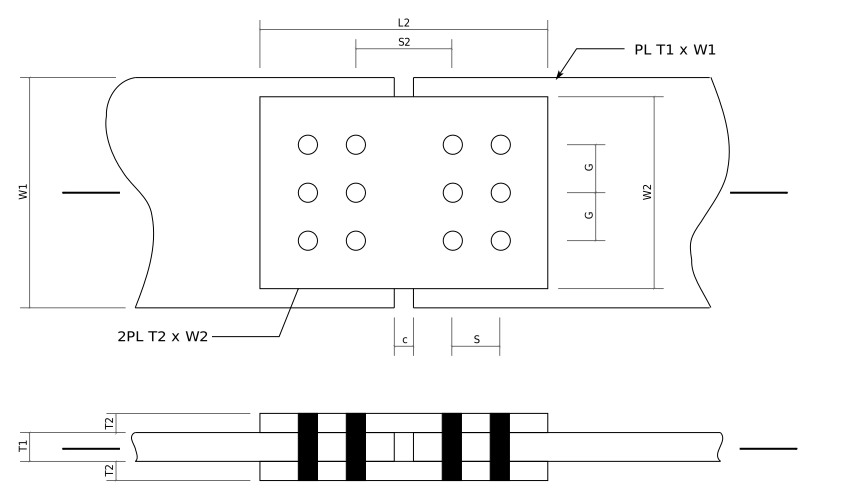

# Compute Tr - Plate Lap Splice

<div markdown="1" class="cell code_cell">
<div class="input_area" markdown="1">
```python
import sys
sys.path[1:1] = ['../ca-steel-design/lib']
from Designer import SST,show
```
</div>

</div>



<div markdown="1" class="cell code_cell">
<div class="input_area" markdown="1">
```python
# Main plate dimensions:
W1 = 300.
T1 = 25.
c = 10.   # clearance between ends
# Lap plate dimensions:
W2 = 220.
T2 = 14.
L2 = 350.
# bolting dimensions
HA = 22. + 2.  # hole allowance - 3/4" bolts in 22mm punched holes
G = 75.     # gauge
S = 75.     # transverse spacing
NT = 3      # number of bolts across
NL = 2      # number of lines of bolts each side
S2 = 140.
show('W1,T1,c,W2,T2,L2,HA,G,S,S2,NT,NL')
```
</div>

<div class="output_wrapper" markdown="1">
<div class="output_subarea" markdown="1">
{:.output_stream}
```
W1 = 300
T1 = 25
c  = 10
W2 = 220
T2 = 14
L2 = 350
HA = 24
G  = 75
S  = 75
S2 = 140
NT = 3
NL = 2
```
</div>
</div>
</div>
