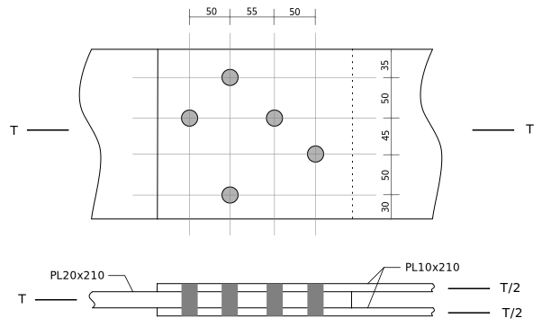

---
redirect_from:
  - "/text/tension/t01/net-areas-01"
interact_link: content/text/tension/T01/net-areas-01.ipynb
kernel_name: python3
has_widgets: false
title: 'T01 v1: Net Areas'
prev_page:
  url: /text/tension/example_problems_01.html
  title: 'Example Problems'
next_page:
  url: /notebooks/tension/tension.html
  title: 'Tension Members'
comment: "***PROGRAMMATICALLY GENERATED, DO NOT EDIT. SEE ORIGINAL FILES IN /content***"
---

# Example T01: Net Areas of Plates with Staggered Holes

Please note that the following type of hole pattern rarely occurs in practice -- practical patterns are more regular and 'grid-like'.  This example illustrates:
* how failure patterns depend on the direction of the load relative to the hole group.
* the calculations necessary to determine a net cross-sectional area for each potential failure pattern.

The  figure shows an irregular bolt pattern in a lap tension splice.  To compute the
net areas of the plates, we must examine every possible failure path that has the
following attributes:

* it separates each plate into 2 complete parts.
* it is of minimum length for that path.
* there are no bolts or holes completely on the loaded side of the path; all of the bolt bearing areas are on the side opposite the load.

In the following example, we will assume M20 bolts in punched holes, and thus the hole
allowance is $20~\mathrm{mm}+2~\mathrm{mm}+2~\mathrm{mm} = 24~\mathrm{mm}$.

**Lap Plate Connection**

## 10mm Plates (outer plates)

The  shows the paths appropriate for investigating the strength of the outside (10mm) plates.
For this case, the loaded side of the connection is toward the right side, and so there are
no complete holes on that side of any path.

 plates")

**Failure Paths for Net Area Calculations, Outside (10mm) plates**

### Path 1-1:

$w_n = 210~\mathrm{mm} - 24~\mathrm{mm} = 186~\mathrm{mm}$

$A_n = w_n t = 186~\mathrm{mm} \times 10~\mathrm{mm} \times 2 = 3720~\mathrm{mm}^2$

### Path 2-2:

$w_n = w - \sum d + \sum{s^2\over 4g}$

$w_n = 210 - 2\times24 + {50^2\over 4\times45} = 175.9~\mathrm{mm}$

$A_n = 175.9 \times 10 \times 2 = 3520~\mathrm{mm}^2$

### Path 3-3:

$w_n = 210 - 3\times24 + \frac{55^2}{4\times50} + \frac{50^2}{4\times45} = 167.0~\mathrm{mm}$

$A_n = 167.0 \times 10 \times 2 = 3340^2~\mathrm{mm}^2\hskip{2in}\leftarrow \mathrm{governs.}$

### Paths 1-4 and 3-4:

Adding the fourth bolt to each of the above paths will reduce the net width by $24~\mathrm{mm}$
for the hole, then
increase it by $105^2/(4\times50) = 55.1~\mathrm{mm}$ for the slope of the segment.   Therefore paths that include this hole will not govern.

### Summary

Path 3-3 governs (i.e., has the minimum area) and thus:

   $A_n = 3340~\mathrm{mm}^2$

for the pair of 10mm plates.

## 20mm Plate (Inner Plate)

The following figure  shows the possible failure paths for calculating the strength of the 20mm plate.
For this case, the loaded side is toward the left.

**Failure Paths for Net Area Calculations, Inside (20mm) plate**

### Path 1-1:

$w_n = 210~\mathrm{mm} - 24~\mathrm{mm} = 186~\mathrm{mm}$

$A_n = w_n t = 186~\mathrm{mm} \times 20~\mathrm{mm} = 3720~\mathrm{mm}^2$

### Path 2-2:

$w_n = 210 - 2\times24 + {50^2\over4\times50} = 174.5~\mathrm{mm}$

$A_n = w_n t = 174.5~\mathrm{mm} \times 20~\mathrm{mm} = 3490~\mathrm{mm}^2$

### Path 2-3:

$w_n = 210 - 3\times24 + {50^2\over4\times50} + {50^2\over4\times95}  = 157.1~\mathrm{mm}$

$A_n = w_n t = 157.1~\mathrm{mm} \times 20~\mathrm{mm} = 3140~\mathrm{mm}^2\hskip{2in}\leftarrow \mathrm{governs.}$

### Path 1-3:

By inspection this will not govern, as path 1-1 is longer than 2-2, therefore 1-3 will be longer than 2-3.

### Summary

Path 2-3 on the 20mm plate governs, and

$A_n = 3140\mathrm{mm}^2$
   
